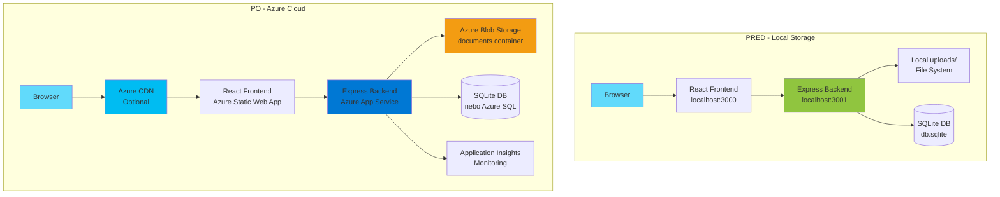
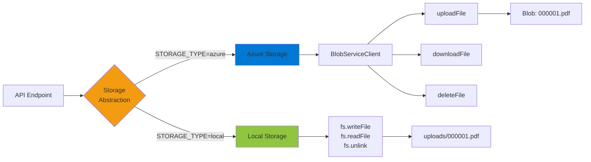

# Azure Deployment - Changelog

## Prehľad zmien

Projekt bol úspešne pripravený na nasadenie do Azure cloud platformy. Všetky zmeny sú spätne kompatibilné - aplikácia funguje rovnako lokálne aj v Azure prostredí.

## ✅ Pridané súbory

### 1. Azure Configuration Files
- **`.env`** - Lokálne environment variables pre development
- **`.env.example`** - Šablóna pre environment variables
- **`.env.azure`** - Azure-specific environment variables
- **`azure.toml`** - Azure Web App deployment konfigurácia
- **`host.json`** - Azure Functions konfigurácia pre logging
- **`web.config`** - IIS/iisnode konfigurácia pre Azure App Service

### 2. Deployment Scripts
- **`deploy-azure.ps1`** - PowerShell deployment skript (Windows)
- **`deploy-azure.sh`** - Bash deployment skript (Linux/Mac)
- **`.github/workflows/azure-deploy.yml`** - GitHub Actions CI/CD pipeline

### 3. Azure Storage Service
- **`azure-storage.js`** - Azure Blob Storage abstraction layer
  - Funkcie: uploadFile, downloadFile, deleteFile, fileExists
  - Automatická správa containerov
  - Stream to buffer konverzie

### 4. Documentation
- **`AZURE_DEPLOYMENT.md`** - Kompletný deployment guide
  - Manuálne nasadenie cez PowerShell
  - Automatické nasadenie cez GitHub Actions
  - Konfigurácia Storage, Database, Monitoring
  - Scaling, Custom Domain, Security
  - Troubleshooting

### 5. Git Configuration
- **`.gitignore`** - Git ignore pravidlá
  - node_modules, .env súbory
  - uploads/, databáza
  - build outputy, IDE súbory

### 6. Frontend Environment
- **`frontend/.env`** - Frontend environment variables
  - REACT_APP_API_URL konfigurácia

## 🔧 Upravené súbory

### 1. server.js
**Zmeny:**
```javascript
// Pridané na začiatok súboru
require('dotenv').config();
const azureStorage = require('./azure-storage');

// Nové konštanty
const PORT = process.env.PORT || 3001;
const STORAGE_TYPE = process.env.STORAGE_TYPE || 'local';

// CORS konfigurácia
const corsOptions = {
    origin: process.env.CORS_ORIGIN || '*',
    credentials: true
};
app.use(cors(corsOptions));

// Nové helper funkcie (storage abstraction)
async function saveFile(fileName, fileBuffer)
async function getFile(fileName)
async function deleteFile(fileName)
async function fileExists(fileName)
```

**Funkcionalita:**
- ✅ Podporuje lokálne aj Azure Blob Storage
- ✅ Automatické prepínanie medzi storage typmi cez ENV variable
- ✅ Konfigurovateľný PORT, CORS origin
- ✅ Dotenv pre environment variables

**Spätná kompatibilita:**
- ✅ Ak nie sú nastavené ENV variables, používa default hodnoty
- ✅ STORAGE_TYPE='local' funguje presne ako predtým
- ✅ Všetky existujúce endpointy fungujú bez zmien

### 2. package.json (backend)
**Pridané dependencies:**
```json
"@azure/storage-blob": "^12.17.0",  // Azure Blob Storage SDK
"dotenv": "^16.4.5"                  // Environment variables
```

**Pridané scripts:**
```json
"dev": "node server.js",
"build": "cd frontend && npm run build",
"build:azure": "cd frontend && npm run build:azure",
"deploy:azure": "powershell -ExecutionPolicy Bypass -File .\\deploy-azure.ps1",
"postinstall": "cd frontend && npm install"
```

**Pridané engines:**
```json
"engines": {
  "node": ">=18.0.0",
  "npm": ">=9.0.0"
}
```

### 3. frontend/package.json
**Pridaný script:**
```json
"build:azure": "REACT_APP_API_URL=/api react-scripts build"
```

**Účel:** Build pre Azure používa relatívnu URL `/api` namiesto `http://localhost:3001`

### 4. frontend/src/hooks/useApi.js
**Zmena:**
```javascript
// Pred
const API_BASE_URL = 'http://localhost:3001/api';

// Po
const API_BASE_URL = process.env.REACT_APP_API_URL 
    ? `${process.env.REACT_APP_API_URL}/api`
    : 'http://localhost:3001/api';
```

**Benefit:** Frontend sa automaticky pripojí na správny backend (localhost alebo Azure)

## 📋 Environment Variables

### Lokálny Development (.env)
```env
NODE_ENV=development
PORT=3001
STORAGE_TYPE=local
CORS_ORIGIN=http://localhost:3000
```

### Azure Production (.env.azure alebo App Settings)
```env
NODE_ENV=production
PORT=8080
STORAGE_TYPE=azure
AZURE_STORAGE_ACCOUNT=microhackstorage
AZURE_STORAGE_KEY=your_key_here
AZURE_STORAGE_CONTAINER=documents
CORS_ORIGIN=https://your-app.azurewebsites.net
```

## 🚀 Ako nasadiť do Azure

### Možnosť 1: Manuálne nasadenie (PowerShell)
```powershell
# 1. Upravte deploy-azure.ps1 (názvy resources)
# 2. Prihláste sa do Azure
az login

# 3. Spustite deployment
.\deploy-azure.ps1
```

### Možnosť 2: GitHub Actions (CI/CD)
```powershell
# 1. Získajte publish profile
az webapp deployment list-publishing-profiles `
    --name your-app-name `
    --resource-group microhack-rg `
    --xml

# 2. Pridajte do GitHub Secrets:
#    - AZURE_WEBAPP_PUBLISH_PROFILE (XML z kroku 1)

# 3. Push do main branch
git push origin main
```

### Možnosť 3: VS Code Azure Extension
1. Nainštalujte "Azure App Service" extension
2. Kliknite na Azure ikonu
3. Kliknite pravým na "App Services" → "Create New Web App"
4. Kliknite pravým na vytvorenú app → "Deploy to Web App"

## 🔄 Migrácia z Local na Azure Storage

### Krok 1: Vytvorte Azure Storage Account
```powershell
az storage account create `
    --name microhackstorage `
    --resource-group microhack-rg `
    --location westeurope `
    --sku Standard_LRS
```

### Krok 2: Získajte Access Key
```powershell
az storage account keys list `
    --account-name microhackstorage `
    --resource-group microhack-rg `
    --query "[0].value" `
    --output tsv
```

### Krok 3: Nahrajte existujúce súbory
```powershell
# Nahrajte všetky PDFs z uploads/ do Azure
az storage blob upload-batch `
    --account-name microhackstorage `
    --destination documents `
    --source ./uploads `
    --pattern "*.pdf"
```

### Krok 4: Zmeňte STORAGE_TYPE
```env
STORAGE_TYPE=azure
AZURE_STORAGE_ACCOUNT=microhackstorage
AZURE_STORAGE_KEY=your_key_from_step_2
AZURE_STORAGE_CONTAINER=documents
```

## 📊 Architektúra

### Porovnanie architektúr



### Storage Abstraction Layer



## ✨ Nové funkcie

### 1. Flexibilné Storage
- Lokálne súbory pre development
- Azure Blob Storage pre produkciu
- Jednoduché prepínanie cez ENV variable

### 2. Environment-based konfigurácia
- Rôzne nastavenia pre dev/prod
- Bezpečné uloženie credentials
- Easy configuration management

### 3. CI/CD Pipeline
- Automatický deployment pri push
- Build a test automation
- Production-ready artifacts

### 4. Scaling ready
- Horizontálne scaling (viac instancií)
- Vertikálne scaling (väčší plan)
- Azure CDN pre statické súbory

## 🔒 Bezpečnostné vylepšenia

1. **Environment Variables:** Citlivé údaje nie sú v kóde
2. **CORS Configuration:** Konfigurovateľný origin
3. **HTTPS:** Automaticky v Azure App Service
4. **Azure Key Vault ready:** Pripravené na integráciu
5. **Managed Identity support:** Možnosť použiť bez keys

## 🧪 Testovanie

### Lokálne
```powershell
# Použite local storage
npm start
# App beží na http://localhost:3001
```

### Azure
```powershell
# Deploy a otvorte URL
az webapp browse --name your-app-name --resource-group microhack-rg
```

## 📝 Ďalšie možné vylepšenia

### Databáza
- [ ] Migrácia na Azure SQL Database (pre produkciu)
- [ ] Connection pooling
- [ ] Database backups

### Monitorovanie
- [ ] Application Insights integrácia
- [ ] Custom metrics
- [ ] Error tracking

### Autentifikácia
- [ ] Azure AD integrácia
- [ ] Multi-tenant support
- [ ] Role-based access control

### Performance
- [ ] Redis cache pre session management
- [ ] CDN pre statické súbory
- [ ] Compression middleware

## 🎯 Súhrn

**Čo sa zmenilo:** Aplikácia bola rozšírená o Azure deployment support

**Čo ostalo rovnaké:** Všetka biznis logika, UI, workflow

**Výhody:**
- ✅ Scalability (môžete pridávať viac serverov)
- ✅ Reliability (Azure SLA 99.95%)
- ✅ Security (HTTPS, managed services)
- ✅ Monitoring (Application Insights)
- ✅ Cost-effective (Free tier pre testing)

**Ako začať:**
1. Vytvorte Azure účet (free trial: $200 credit)
2. Nainštalujte Azure CLI
3. Spustite `.\deploy-azure.ps1`
4. Vaša aplikácia je online!
