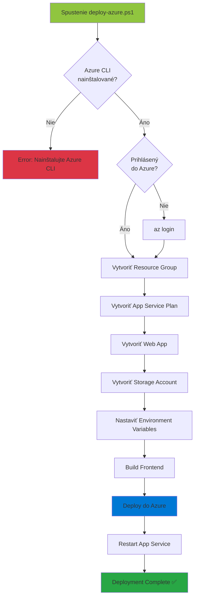
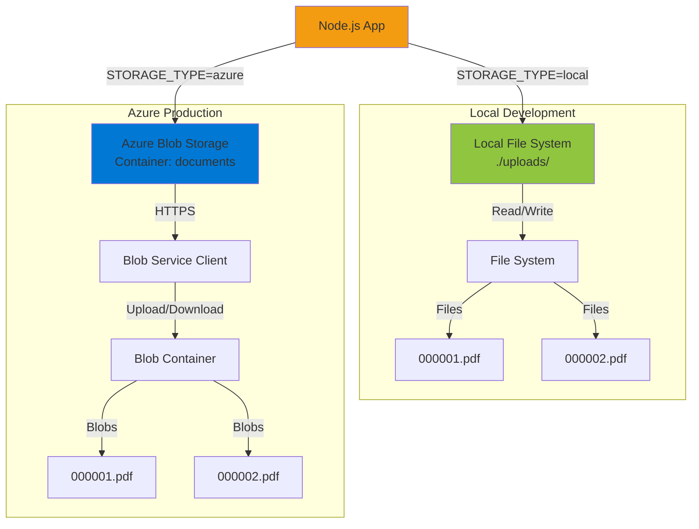

# Azure Deployment Guide

Tento dokument obsahuje pokyny pre nasadenie aplikácie do Azure cloud platformy.

## Architektúra Azure Deployment

```mermaid
graph TB
    subgraph "Azure Cloud"
        subgraph "Resource Group: microhack-rg"
            AppService[App Service<br/>microhack-app]
            AppPlan[App Service Plan<br/>B1 Basic]
            Storage[Blob Storage<br/>microhackstorage]
            Insights[Application Insights<br/>Monitoring]
        end
        
        CDN[Azure CDN<br/>Optional]
    end
    
    subgraph "External"
        GitHub[GitHub Actions<br/>CI/CD]
        Users[End Users]
    end
    
    GitHub -->|Deploy| AppService
    Users -->|HTTPS| CDN
    CDN -->|Request| AppService
    Users -.->|Direct HTTPS| AppService
    AppService -->|Read/Write| Storage
    AppService -->|Telemetry| Insights
    AppPlan -->|Hosts| AppService
    
    style AppService fill:#0078d4
    style Storage fill:#f39c12
    style GitHub fill:#24292e
    style CDN fill:#00bcf2
```



## Príprava

### 1. Nainštalujte Azure CLI
```powershell
# Windows (cez Chocolatey)
choco install azure-cli

# Alebo stiahnite z: https://aka.ms/installazurecliwindows
```

### 2. Prihláste sa do Azure
```powershell
az login
```

### 3. Nastavte správnu subscription
```powershell
# Zobrazte dostupné subscriptions
az account list --output table

# Nastavte aktívnu subscription
az account set --subscription "SUBSCRIPTION_ID"
```

## Manuálne nasadenie cez PowerShell skript

### 1. Upravte deployment skript
Otvorte `deploy-azure.ps1` a upravte tieto premenné:
```powershell
$resourceGroup = "microhack-rg"          # Názov resource group
$location = "westeurope"                  # Azure región
$appServicePlan = "microhack-plan"       # App Service plan
$webAppName = "microhack-app-UNIQUE"     # Unikátny názov aplikácie
$storageAccount = "microhackstorage"     # Storage account (malé písmená, bez pomlčiek)
```

### 2. Spustite deployment
```powershell
.\deploy-azure.ps1
```

### Deployment Process



Skript vykoná:
- ✅ Vytvorenie Resource Group
- ✅ Vytvorenie App Service Plan (Free tier)
- ✅ Vytvorenie Web App
- ✅ Vytvorenie Storage Account
- ✅ Nastavenie environment variables
- ✅ Nasadenie aplikácie

## Automatické nasadenie cez GitHub Actions

### 1. Získajte Publish Profile
```powershell
az webapp deployment list-publishing-profiles `
    --name microhack-app-UNIQUE `
    --resource-group microhack-rg `
    --xml
```

### 2. Pridajte GitHub Secret
1. Prejdite na GitHub repository → Settings → Secrets and variables → Actions
2. Kliknite na "New repository secret"
3. Názov: `AZURE_WEBAPP_PUBLISH_PROFILE`
4. Hodnota: Vložte XML z predchádzajúceho kroku
5. Kliknite "Add secret"

### 3. Upravte workflow súbor
Otvorte `.github/workflows/azure-deploy.yml` a upravte:
```yaml
env:
  AZURE_WEBAPP_NAME: microhack-app-UNIQUE  # Váš názov aplikácie
```

### 4. Push do main branch
```bash
git add .
git commit -m "Configure Azure deployment"
git push origin main
```

GitHub Actions automaticky nasadí aplikáciu pri každom push do main branch.

### GitHub Actions Workflow

```mermaid
graph LR
    A[Git Push] --> B[GitHub Actions Triggered]
    B --> C[Checkout Code]
    C --> D[Setup Node.js]
    D --> E[Install Dependencies]
    E --> F[Build Frontend]
    F --> G[Run Tests]
    G --> H{Tests Pass?}
    H -->|Yes| I[Create Artifact]
    H -->|No| J[Fail Build]
    I --> K[Deploy to Azure]
    K --> L[Set App Settings]
    L --> M[Restart App Service]
    M --> N[Deployment Complete]
    
    style A fill:#24292e
    style K fill:#0078d4
    style N fill:#28a745
    style J fill:#dc3545
```



## Konfigurácia Storage

### Storage Options



### Azure Blob Storage (Produkcia)
```powershell
# Získajte connection string
az storage account show-connection-string `
    --name microhackstorage `
    --resource-group microhack-rg `
    --query connectionString `
    --output tsv
```

Nastavte v Azure Web App:
```powershell
az webapp config appsettings set `
    --name microhack-app-UNIQUE `
    --resource-group microhack-rg `
    --settings `
        STORAGE_TYPE=azure `
        AZURE_STORAGE_ACCOUNT=microhackstorage `
        AZURE_STORAGE_KEY="YOUR_STORAGE_KEY" `
        AZURE_STORAGE_CONTAINER=documents
```

### Local Storage (Development)
```powershell
# V .env súbore
STORAGE_TYPE=local
```

## Databáza

Aplikácia používa SQLite, ktorý je vhodný pre menšie aplikácie. Pre produkčné nasadenie zvážte:

### Azure SQL Database
```powershell
# Vytvorte SQL Server
az sql server create `
    --name microhack-sql `
    --resource-group microhack-rg `
    --location westeurope `
    --admin-user sqladmin `
    --admin-password "YourPassword123!"

# Vytvorte databázu
az sql db create `
    --resource-group microhack-rg `
    --server microhack-sql `
    --name microhack-db `
    --service-objective S0
```

Upravte `database.js` aby podporoval Azure SQL (použite `mssql` npm package).

## Environment Variables

### Lokálny development (.env)
```env
NODE_ENV=development
PORT=3001
STORAGE_TYPE=local
CORS_ORIGIN=http://localhost:3000
```

### Azure produkcia
```env
NODE_ENV=production
PORT=8080
STORAGE_TYPE=azure
AZURE_STORAGE_ACCOUNT=microhackstorage
AZURE_STORAGE_KEY=your_storage_key
AZURE_STORAGE_CONTAINER=documents
CORS_ORIGIN=https://microhack-app.azurewebsites.net
```

## Monitorovanie

### Zapnite Application Insights
```powershell
az monitor app-insights component create `
    --app microhack-insights `
    --location westeurope `
    --resource-group microhack-rg `
    --application-type web

# Získajte instrumentation key
az monitor app-insights component show `
    --app microhack-insights `
    --resource-group microhack-rg `
    --query instrumentationKey
```

### Nastavte logging
```powershell
az webapp log config `
    --name microhack-app-UNIQUE `
    --resource-group microhack-rg `
    --application-logging filesystem `
    --level information
```

### Zobrazenie logov
```powershell
az webapp log tail `
    --name microhack-app-UNIQUE `
    --resource-group microhack-rg
```

## Scaling

### Vertikálne scaling (väčší plan)
```powershell
az appservice plan update `
    --name microhack-plan `
    --resource-group microhack-rg `
    --sku B1
```

### Horizontálne scaling (viac instancií)
```powershell
az appservice plan update `
    --name microhack-plan `
    --resource-group microhack-rg `
    --number-of-workers 2
```

## Custom Domain

### Pridanie custom domain
```powershell
# Pridajte doménu
az webapp config hostname add `
    --webapp-name microhack-app-UNIQUE `
    --resource-group microhack-rg `
    --hostname www.yourcompany.sk

# Zapnite HTTPS
az webapp config ssl bind `
    --name microhack-app-UNIQUE `
    --resource-group microhack-rg `
    --certificate-thumbprint YOUR_CERT_THUMBPRINT `
    --ssl-type SNI
```

## Troubleshooting

### Aplikácia nefunguje po nasadení
```powershell
# Skontrolujte logy
az webapp log tail --name microhack-app-UNIQUE --resource-group microhack-rg

# Skontrolujte environment variables
az webapp config appsettings list --name microhack-app-UNIQUE --resource-group microhack-rg

# Reštartujte aplikáciu
az webapp restart --name microhack-app-UNIQUE --resource-group microhack-rg
```

### Súbory sa neukladajú
```powershell
# Skontrolujte, či je STORAGE_TYPE=azure
# Skontrolujte, či sú nastavené správne Azure Storage credentials
# Overte, že container "documents" existuje v Storage Account
```

### Frontend sa nenačíta
```powershell
# Skontrolujte, či je frontend build v správnom adresári
# Overte, že server.js servuje statické súbory z frontend/build
```

## Náklady

**Free Tier (Vhodný pre development a testing):**
- App Service Plan F1: Zadarmo (obmedzené na 60 minút/deň CPU času)
- Storage Account: Prvých 5GB zadarmo, potom ~$0.02/GB/mesiac
- Celkom: ~$0-2/mesiac pre malé použitie

**Basic Tier (Vhodný pre produkciu):**
- App Service Plan B1: ~$13/mesiac
- Storage Account: ~$1-5/mesiac (v závislosti od objemu dát)
- Azure SQL Database S0: ~$15/mesiac
- Celkom: ~$30-35/mesiac

## Bezpečnosť

### Odporúčania pre produkciu:
1. ✅ Používajte HTTPS (automaticky v Azure)
2. ✅ Nastavte CORS len na konkrétnu doménu (nie `*`)
3. ✅ Používajte Azure Key Vault pre sensitive data
4. ✅ Zapnite Azure AD autentifikáciu
5. ✅ Pravidelne aktualizujte npm balíčky
6. ✅ Zapnite DDoS protection
7. ✅ Používajte managed identities namiesto connection strings

### Azure Key Vault integrácia
```powershell
# Vytvorte Key Vault
az keyvault create `
    --name microhack-vault `
    --resource-group microhack-rg `
    --location westeurope

# Pridajte secret
az keyvault secret set `
    --vault-name microhack-vault `
    --name StorageAccountKey `
    --value "YOUR_STORAGE_KEY"

# Povoľte Web App prístup
az webapp identity assign `
    --name microhack-app-UNIQUE `
    --resource-group microhack-rg
```

## Užitočné príkazy

```powershell
# Zoznam všetkých resources v resource group
az resource list --resource-group microhack-rg --output table

# Zobrazenie URL aplikácie
az webapp show --name microhack-app-UNIQUE --resource-group microhack-rg --query defaultHostName --output tsv

# Vymazanie všetkých resources (pozor!)
az group delete --name microhack-rg --yes --no-wait
```

## Ďalšie zdroje

- [Azure App Service dokumentácia](https://docs.microsoft.com/en-us/azure/app-service/)
- [Azure Blob Storage dokumentácia](https://docs.microsoft.com/en-us/azure/storage/blobs/)
- [Azure CLI príklady](https://docs.microsoft.com/en-us/cli/azure/)
- [GitHub Actions pre Azure](https://github.com/Azure/actions)
