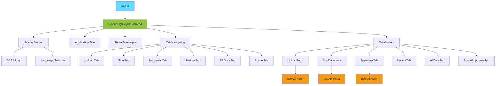
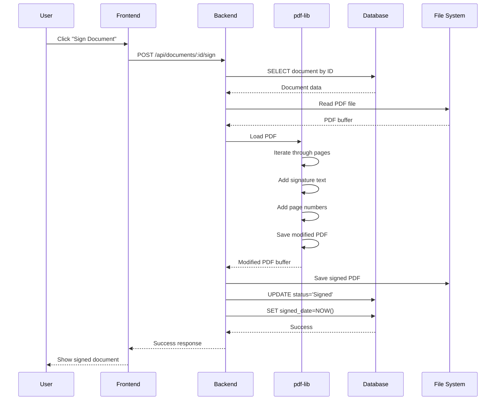

# Design Document - Document Management & Approval System

## Table of Contents
1. [Project Overview](#project-overview)
2. [System Architecture](#system-architecture)
3. [Design Principles](#design-principles)
4. [User Interface Design](#user-interface-design)
5. [Data Flow](#data-flow)
6. [Component Design](#component-design)
7. [API Design](#api-design)
8. [Database Design](#database-design)
9. [Security Design](#security-design)
10. [Performance Considerations](#performance-considerations)

---

## Project Overview

### Purpose
A web-based application for managing PDF documents with electronic signing and multi-level approval workflows.

### Target Users
- **End Users**: Upload, sign, and manage documents
- **Approvers**: Review and approve/reject documents
- **Administrators**: Manage predefined approver database

### Key Features
- PDF document upload and replacement
- Electronic signature with timestamps
- Multi-approver workflow
- Document status tracking
- Multi-language support (Slovak/English)
- Admin panel for approver management

---

## System Architecture

### High-Level Architecture

```mermaid
graph TB
    subgraph "Frontend Layer"
        A[React Components]
        B[i18n Translation]
        C[Axios API Client]
        D[CSS Styles]
    end
    
    subgraph "Backend Layer"
        E[Express Router]
        F[Multer Upload]
        G[pdf-lib PDF Processing]
        H[CORS Middleware]
    end
    
    subgraph "Persistence Layer"
        I[(SQLite Database)]
        J[File System Storage<br>/uploads/]
    end
    
    A -->|HTTP/REST API| E
    B --> A
    C --> A
    D --> A
    
    E --> F
    E --> G
    E --> H
    
    E -->|SQL Queries| I
    F -->|Save Files| J
    G -->|Read/Write PDF| J
    
    style A fill:#61dafb
    style E fill:#90c53f
    style I fill:#003b57
    style J fill:#f39c12
```



### Technology Stack

**Frontend:**
- **Framework**: React 19.2.0
- **State Management**: React Hooks (useState, useEffect, useCallback)
- **HTTP Client**: Axios 1.12.2
- **Internationalization**: react-i18next 16.0.1
- **Styling**: CSS3 (custom styles)
- **Build Tool**: react-scripts 5.0.1

**Backend:**
- **Runtime**: Node.js 18+
- **Framework**: Express 5.1.0
- **File Upload**: Multer 2.0.2
- **PDF Processing**: pdf-lib 1.17.1
- **Database**: SQLite3 5.1.7
- **CORS**: cors 2.8.5

**Development:**
- **Version Control**: Git
- **Package Manager**: npm
- **Code Editor**: VS Code

---

## Design Principles

### 1. Simplicity
- Clean, intuitive user interface
- Minimal learning curve
- Clear visual hierarchy
- Consistent design patterns

### 2. User-Centric Design
- Task-oriented workflow
- Progressive disclosure of complexity
- Clear feedback for all actions
- Accessibility considerations

### 3. Reliability
- Robust error handling
- Transaction safety for file operations
- Database integrity constraints
- Graceful degradation

### 4. Maintainability
- Modular component architecture
- Separation of concerns
- DRY (Don't Repeat Yourself) principle
- Clear naming conventions

### 5. Scalability
- Stateless API design
- Efficient database queries
- Optimized file storage
- Cacheable resources

---

## User Interface Design

### Design Language

**Color Palette:**
```
Primary Colors:
- Brand Blue:     #007bff  (Actions, links)
- Success Green:  #28a745  (Approved, positive actions)
- Warning Yellow: #ffc107  (Pending, cautionary states)
- Danger Red:     #dc3545  (Rejected, destructive actions)
- Info Cyan:      #17a2b8  (Informational messages)

Neutral Colors:
- Dark Gray:      #6c757d  (Draft state, disabled elements)
- Light Gray:     #f8f9fa  (Backgrounds, cards)
- White:          #ffffff  (Main background)
- Text Dark:      #333333  (Primary text)
- Text Light:     #666666  (Secondary text)
```

**Typography:**
```
Headings:
- H1: 2.5rem (40px) - Bold - Main Title
- H2: 2rem   (32px) - Bold - Section Titles
- H3: 1.75rem (28px) - SemiBold - Subsections
- H4: 1.5rem (24px) - Medium - Card Titles

Body Text:
- Regular: 1rem (16px) - Normal weight
- Small:   0.875rem (14px) - Helper text, labels
- Tiny:    0.75rem (12px) - Timestamps, metadata

Font Family: System fonts (sans-serif)
Line Height: 1.5
```

**Spacing System:**
```
- xs:  4px   (0.25rem)
- sm:  8px   (0.5rem)
- md:  16px  (1rem)
- lg:  24px  (1.5rem)
- xl:  32px  (2rem)
- 2xl: 48px  (3rem)
```

**Border Radius:**
```
- Small:  4px  (buttons, badges)
- Medium: 8px  (cards, inputs)
- Large:  12px (containers)
- Round:  50%  (avatars, circular elements)
```

### Layout Structure

```
┌─────────────────────────────────────────────────────────────┐
│  Logo                                    Language Switcher  │
├─────────────────────────────────────────────────────────────┤
│                     Application Title                       │
├─────────────────────────────────────────────────────────────┤
│                     Status Messages                         │
├─────────────────────────────────────────────────────────────┤
│  Tab1 │ Tab2 │ Tab3 │ Tab4 │ Tab5 │ Tab6                    │
├─────────────────────────────────────────────────────────────┤
│                                                             │
│                                                             │
│                     Tab Content Area                        │
│                                                             │
│                                                             │
└─────────────────────────────────────────────────────────────┘
```

### Component Hierarchy



### Visual States

**Document Status Visual Indicators:**

| Status | Color | Icon | Border |
|--------|-------|------|--------|
| Draft | Gray | 📝 | Solid |
| Signed | Green | ✍️ | Solid |
| Waiting for Approval | Yellow | ⏳ | Dashed |
| Final Approved | Green | ✅ | Double |
| Rejected | Red | ❌ | Solid |

**Interactive States:**

**Buttons:**
- Default: Solid color, shadow
- Hover: Slightly darker, raised shadow
- Active: Darker, inset shadow
- Disabled: 50% opacity, no shadow, no pointer

**Input Fields:**
- Default: Light border, white background
- Focus: Blue border, slight glow
- Error: Red border, red text
- Disabled: Gray background, no interaction

**Cards:**
- Default: White background, subtle shadow
- Hover: Raised shadow (on clickable cards)
- Active: Blue left border

### Responsive Design

**Breakpoints:**
```
- Mobile:  < 768px
- Tablet:  768px - 1024px
- Desktop: > 1024px
```

**Mobile Adaptations:**
- Stack tabs vertically
- Full-width buttons
- Collapsed navigation
- Touch-friendly targets (min 44x44px)

---

## Data Flow

### Document Upload Flow

```
User Action                Backend Processing           Database Update
────────────────────────────────────────────────────────────────────────

[Select PDF File]
       │
       ▼
[Click Upload] ────────────► [Multer receives file]
                                     │
                                     ▼
                             [Generate Case ID]
                                     │
                                     ▼
                             [Rename to {caseId}.pdf]
                                     │
                                     ▼
                             [Move to /uploads] ────────► [INSERT into documents]
                                     │                            │
                                     ▼                            ▼
                             [Return success] ◄───────── [Return document ID]
       ▲
       │
[Display confirmation]
```

### Document Signing Flow



### Approval Workflow Flow

```
User Action                Backend Processing           Database Update
────────────────────────────────────────────────────────────────────────

[Select Approvers]
       │
       ▼
[Submit List] ─────────────► [Validate emails]
                                     │
                                     ▼
                             [For each approver:] ────► [INSERT into approvers]
                                     │                   [status = 'Pending']
                                     ▼                          │
                             [Generate tokens] ◄────────────────┘
                                     │
                                     ▼
                             [Update document] ────────► [UPDATE status = 
                                     │                    'Waiting for Approval']
                                     ▼                          │
                             [Return links] ◄────────────────────┘
       ▲
       │
[Display approvers]

═══════════════════════════════════════════════════════════════════════

[Approver Action] ─────────► [Validate token]
                                     │
                                     ▼
                             [Update approver] ────────► [UPDATE approvers
                                     │                    SET status = 'Approved/Rejected']
                                     ▼                          │
                             [Check all approvers] ◄─────────────┘
                                     │
                                     ├─ All approved ──────► [UPDATE documents
                                     │                        SET status = 'Final Approved']
                                     │                       [Add approved.jpg to PDF]
                                     │
                                     └─ Any rejected ──────► [UPDATE documents
                                                              SET status = 'Rejected']
                                                             [Add rejected.png to PDF]
```

### File Replacement Flow

```
User Action                Backend Processing           Database/File Update
────────────────────────────────────────────────────────────────────────

[Select New File]
       │
       ▼
[Click Replace] ───────────► [Validate status = 'Draft']
                                     │
                                     ▼
                             [Multer saves temp file]
                                     │
                                     ▼
                             [Delete old file] ────────► [DELETE {caseId}.pdf]
                                     │
                                     ▼
                             [Copy temp to final] ──────► [WRITE {caseId}.pdf]
                                     │
                                     ▼
                             [Delete temp file]
                                     │
                                     ▼
                             [Update database] ─────────► [UPDATE documents
                                     │                     SET original_filename
                                     ▼                     SET file_path]
                             [Return success] ◄───────────────┘
       ▲
       │
[Confirm replacement]
```

---

## Component Design

### Core Components

#### 1. UploadSignAppRefactored (Main Container)

**Responsibility:**
- Application state management
- Tab navigation
- Orchestration of child components
- API communication coordination

**State:**
```javascript
{
  caseName: string,           // Current case ID
  documentId: number|null,    // Current document ID
  uploadStatus: string,       // Status messages
  history: object|null,       // Document history
  allDocuments: array,        // List of all documents
  activeTab: number,          // Currently active tab (1-6)
  selectedApprovers: array,   // Selected approvers
  predefinedApprovers: array, // Available approvers
  approvalLinks: array        // Simulation links
}
```

**Methods:**
- `loadNextCaseId()` - Fetch next available Case ID
- `loadPredefinedApprovers()` - Load approver list
- `handleUploadSuccess()` - Process upload completion
- `handleSignSuccess()` - Process signing completion
- `handleViewHistory()` - Refresh document history
- `handleNewDocument()` - Reset for new document
- `handleReplaceDocument()` - Process file replacement

#### 2. UploadForm

**Responsibility:**
- File upload interface
- File replacement interface
- Comment input

**Props:**
```javascript
{
  caseName: string,
  onUploadSuccess: function,
  documentId: number|null,
  onNewDocument: function,
  history: object|null,
  onReplaceDocument: function
}
```

**States:**
- New upload form (no documentId)
- Replacement form (documentId + Draft status)
- Success message (documentId + other status)

**Validation:**
- File type: PDF only
- File required before submit
- Draft status required for replacement

#### 3. SignDocument

**Responsibility:**
- Document signing interface
- Display document information
- Trigger signing process

**Props:**
```javascript
{
  documentId: number,
  caseName: string,
  history: object,
  onSignSuccess: function
}
```

**Conditions:**
- Enabled only if document exists
- Shows document metadata
- Confirms before signing
- Updates status after success

#### 4. ApproversTab

**Responsibility:**
- Approver selection (dynamic/manual)
- Display current approvers
- Manage approval status

**Props:**
```javascript
{
  documentId: number,
  history: object,
  approverEmails: string,
  setApproverEmails: function,
  selectedApprovers: array,
  setSelectedApprovers: function,
  predefinedApprovers: array,
  showApproverDropdown: number|null,
  setShowApproverDropdown: function,
  approvalLinks: array,
  onApproversAdded: function,
  onApprovalAction: function
}
```

**Features:**
- Dynamic dropdown selection
- Manual email input
- Validation of document status
- Simulation controls

#### 5. AdminApproversTab

**Responsibility:**
- CRUD operations for approvers
- Display approver list
- Manage active/inactive status

**State:**
```javascript
{
  approvers: array,
  editingId: number|null,
  formData: {
    name: string,
    email: string,
    department: string
  }
}
```

**Operations:**
- Create new approver
- Update existing approver
- Soft delete (deactivate)
- Hard delete (permanent removal)

### Utility Components

#### StatusBadge
**Purpose:** Visual indicator for document/approver status

```javascript
<StatusBadge status="Signed" />
```

**Styles by Status:**
- Draft: Gray background
- Signed: Green background
- Waiting: Yellow background
- Approved: Green background
- Rejected: Red background

#### LanguageSwitcher
**Purpose:** Toggle between Slovak and English

```javascript
<LanguageSwitcher />
```

**Functionality:**
- Current language indicator
- Click to toggle
- Persists in localStorage
- Updates all i18n texts

---

## API Design

### RESTful Principles

**Resource-Based URLs:**
- `/api/documents` - Document collection
- `/api/document/:id` - Single document
- `/api/approvers/:documentId` - Approvers for document
- `/api/admin/approvers` - Approver management

**HTTP Methods:**
- GET - Retrieve resources
- POST - Create new resources
- PUT - Update existing resources
- DELETE - Remove resources

**Status Codes:**
- 200 OK - Successful GET/PUT
- 201 Created - Successful POST
- 400 Bad Request - Validation error
- 404 Not Found - Resource not found
- 500 Internal Server Error - Server error

### API Endpoints Specification

#### 1. Get Next Case ID
```
GET /api/next-case-id

Response:
{
  "nextCaseId": "000042"
}
```

#### 2. Upload/Replace Document
```
POST /api/upload
Content-Type: multipart/form-data

Request Body:
- document: File (PDF)
- comment: String (optional)
- replace: String ("true" for replacement)
- documentId: Number (required if replace=true)

Response:
{
  "message": "Document successfully uploaded",
  "documentId": 42,
  "caseId": "000042"
}

Errors:
- 400: File required
- 400: Cannot replace (wrong status)
- 404: Document not found (replacement)
- 500: File system/database error
```

#### 3. Sign Document
```
POST /api/sign/:documentId

Response:
{
  "message": "Document successfully signed and locked",
  "filePath": "/uploads/000042.pdf"
}

Errors:
- 404: Document not found
- 500: PDF processing error
```

#### 4. Add Approvers
```
POST /api/approvers/:documentId
Content-Type: application/json

Request Body:
{
  "approverEmails": ["email1@example.com", "email2@example.com"]
}

Response:
{
  "message": "Approvers added",
  "approvalLinks": [
    {
      "email": "email1@example.com",
      "link": "http://localhost:3001/approve/1/token123"
    }
  ]
}

Errors:
- 400: No approvers provided
- 500: Database error
```

#### 5. Approve/Reject
```
POST /api/approve/:approverId
Content-Type: application/json

Request Body:
{
  "action": "Approve" | "Disapprove"
}

Response:
{
  "message": "Document marked as Approved/Rejected"
}

Errors:
- 400: Invalid action
- 404: Approver not found
- 500: Database error
```

#### 6. Get Document Detail
```
GET /api/document/:documentId

Response:
{
  "id": 42,
  "case_name": "000042",
  "original_filename": "contract.pdf",
  "file_path": "/path/to/file.pdf",
  "comment": "Annual contract",
  "status": "Waiting for Approval",
  "upload_date": "2025-10-18 10:30:00",
  "signed_date": "2025-10-18 11:15:00",
  "approvers": [
    {
      "approver_email": "john@example.com",
      "approval_status": "Approved",
      "approval_date": "2025-10-18 12:00:00"
    }
  ]
}

Errors:
- 404: Document not found
- 500: Database error
```

#### 7. Get All Documents
```
GET /api/documents

Response:
{
  "documents": [
    {
      "id": 42,
      "case_name": "000042",
      "original_filename": "contract.pdf",
      "status": "Final Approved",
      "upload_date": "2025-10-18 10:30:00",
      "signed_date": "2025-10-18 11:15:00",
      "total_approvers": 3,
      "approved_count": 3,
      "rejected_count": 0,
      "pending_count": 0
    }
  ],
  "totalCount": 42
}

Errors:
- 500: Database error
```

### Error Response Format

```json
{
  "error": "Human-readable error message",
  "details": "Technical details (development only)",
  "code": "ERROR_CODE"
}
```

---

## Database Design

### Schema Design

#### Entity-Relationship Diagram

```
┌─────────────────────┐
│     documents       │
├─────────────────────┤
│ id (PK)             │
│ case_name (UK)      │
│ original_filename   │
│ file_path           │
│ comment             │
│ status              │
│ upload_date         │
│ signed_date         │
└──────────┬──────────┘
           │
           │ 1:N
           │
           ▼
┌─────────────────────┐
│     approvers       │
├─────────────────────┤
│ id (PK)             │
│ document_id (FK)    │
│ approver_email      │
│ approval_status     │
│ approval_date       │
└─────────────────────┘

┌─────────────────────────┐
│  predefined_approvers   │
├─────────────────────────┤
│ id (PK)                 │
│ name                    │
│ email (UK)              │
│ department              │
│ active                  │
│ created_date            │
└─────────────────────────┘
```

### Table Specifications

#### documents
```sql
CREATE TABLE documents (
    id INTEGER PRIMARY KEY AUTOINCREMENT,
    case_name TEXT NOT NULL UNIQUE,
    original_filename TEXT NOT NULL,
    file_path TEXT NOT NULL,
    comment TEXT,
    status TEXT DEFAULT 'Draft',
    upload_date DATETIME DEFAULT CURRENT_TIMESTAMP,
    signed_date DATETIME
);

CREATE INDEX idx_documents_status ON documents(status);
CREATE INDEX idx_documents_case_name ON documents(case_name);
```

**Constraints:**
- case_name must be unique
- status must be one of: Draft, Signed, Waiting for Approval, Final Approved, Rejected

#### approvers
```sql
CREATE TABLE approvers (
    id INTEGER PRIMARY KEY AUTOINCREMENT,
    document_id INTEGER NOT NULL,
    approver_email TEXT NOT NULL,
    approval_status TEXT DEFAULT 'Pending',
    approval_date DATETIME,
    FOREIGN KEY (document_id) REFERENCES documents(id)
);

CREATE INDEX idx_approvers_document ON approvers(document_id);
CREATE INDEX idx_approvers_status ON approvers(approval_status);
```

**Constraints:**
- approval_status must be one of: Pending, Approved, Rejected
- document_id must reference valid document

#### predefined_approvers
```sql
CREATE TABLE predefined_approvers (
    id INTEGER PRIMARY KEY AUTOINCREMENT,
    name TEXT NOT NULL,
    email TEXT NOT NULL UNIQUE,
    department TEXT NOT NULL,
    active INTEGER DEFAULT 1,
    created_date DATETIME DEFAULT CURRENT_TIMESTAMP
);

CREATE INDEX idx_predefined_active ON predefined_approvers(active);
CREATE UNIQUE INDEX idx_predefined_email ON predefined_approvers(email);
```

**Constraints:**
- email must be unique
- active is boolean (0 or 1)

### Data Integrity

**Referential Integrity:**
- approvers.document_id → documents.id (CASCADE on delete)
- No orphan approver records

**Business Rules:**
- Cannot delete document with approvers in process
- Cannot modify signed documents (except admin)
- Case ID must be sequential

**Transaction Safety:**
- File operations wrapped in try-catch
- Database rollback on file operation failure
- Atomic status updates

---

## Security Design

### Current Implementation

**CORS Policy:**
```javascript
app.use(cors()); // Allow all origins (development)
```

**File Upload Security:**
- Accept only PDF files (checked by multer)
- Unique filenames prevent collisions
- Size limit can be configured

**Database:**
- SQLite file-based (single-user)
- No SQL injection (parameterized queries)

**API:**
- No authentication (prototype)
- No authorization (prototype)
- No rate limiting

### Production Security Requirements

#### 1. Authentication
```
Recommended: JWT (JSON Web Tokens)

Flow:
1. User login → Receive JWT token
2. Include token in Authorization header
3. Validate token on each request
4. Refresh token mechanism
```

#### 2. Authorization
```
Role-Based Access Control (RBAC):

Roles:
- User: Upload, sign own documents
- Approver: Approve assigned documents
- Admin: Manage approvers, view all documents

Permissions Matrix:
                Upload  Sign  Approve  Admin
User              ✓      ✓      -       -
Approver          ✓      ✓      ✓       -
Admin             ✓      ✓      ✓       ✓
```

#### 3. Data Protection
```
- HTTPS only in production
- Encrypt sensitive data at rest
- Sanitize all user inputs
- Validate file types deeply (not just extension)
- Scan uploaded files for malware
```

#### 4. API Security
```
- Rate limiting (e.g., 100 req/min per IP)
- Request size limits
- CSRF protection
- Content Security Policy headers
- XSS prevention
```

---

## Performance Considerations

### Frontend Optimization

**Code Splitting:**
```javascript
// Lazy load admin component
const AdminTab = React.lazy(() => import('./AdminApproversTab'));
```

**Memoization:**
```javascript
// Prevent unnecessary re-renders
const memoizedValue = useMemo(() => expensiveComputation(), [deps]);
```

**Debouncing:**
```javascript
// Debounce search input
const debouncedSearch = debounce(searchFunction, 300);
```

### Backend Optimization

**Database Indexing:**
```sql
-- Fast lookups by status
CREATE INDEX idx_documents_status ON documents(status);

-- Fast Case ID generation
CREATE INDEX idx_documents_case_name ON documents(case_name);
```

**Query Optimization:**
```javascript
// Join approvers in single query
SELECT d.*, COUNT(a.id) as approver_count
FROM documents d
LEFT JOIN approvers a ON d.id = a.document_id
GROUP BY d.id
```

**Caching Strategy:**
```
- Cache predefined approvers list (changes rarely)
- Cache document counts for dashboard
- Use ETags for static file serving
```

### File Storage Optimization

**Naming Convention:**
```
{caseId}.pdf  (e.g., 000042.pdf)
- Short, predictable names
- Easy to locate
- No random characters
```

**Storage Structure:**
```
/uploads/
  000001.pdf
  000002.pdf
  ...

Future: Partition by year/month
/uploads/2025/10/000001.pdf
```

**PDF Processing:**
```
- Process PDFs asynchronously for large files
- Stream file reads/writes
- Limit concurrent PDF operations
```

### Scalability Considerations

**Horizontal Scaling:**
```
Current: Single server
Future: Load-balanced servers
- Shared file storage (NFS, S3)
- Centralized database (PostgreSQL)
- Session management (Redis)
```

**Vertical Scaling:**
```
- Increase Node.js memory limit
- Optimize SQLite settings
- Use connection pooling
```

---

## Future Enhancements

### Phase 2 Features
1. **Email Integration**
   - Automatic email notifications
   - Email-based approval links
   - Status change notifications

2. **Advanced Search**
   - Full-text search in documents
   - Filter by date range
   - Filter by status/approver

3. **Audit Trail**
   - Complete action history
   - Who changed what and when
   - Compliance reporting

### Phase 3 Features
1. **Workflow Customization**
   - Configurable approval chains
   - Conditional routing
   - Parallel/sequential approvals

2. **Document Templates**
   - Predefined document types
   - Auto-fill fields
   - Template management

3. **Mobile App**
   - Native iOS/Android apps
   - Push notifications
   - Offline capability

---

## Conclusion

This design document serves as a comprehensive guide to the Document Management & Approval System architecture, design decisions, and implementation details. It should be updated as the system evolves and new requirements emerge.

**Version:** 1.0  
**Last Updated:** October 2025  
**Next Review:** December 2025

