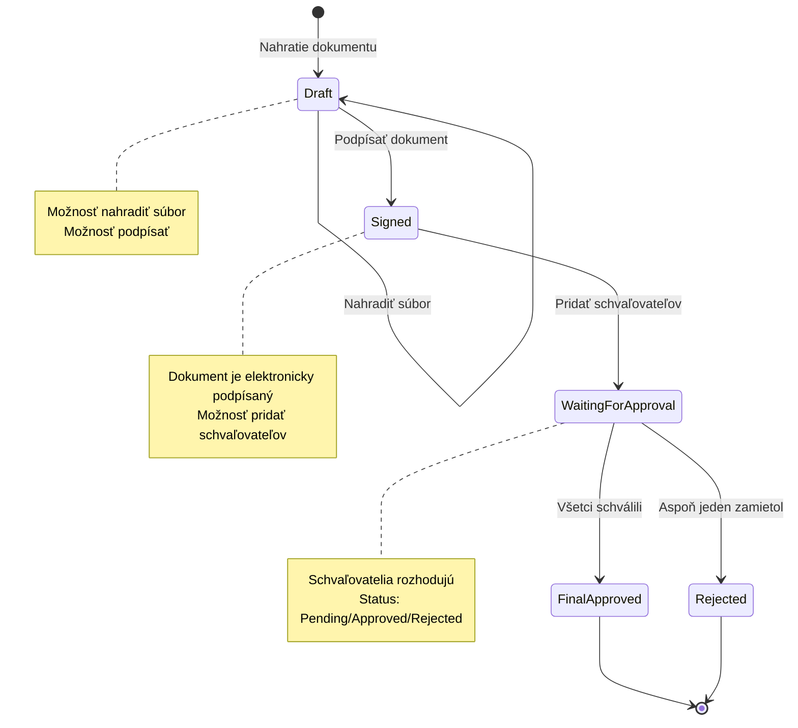
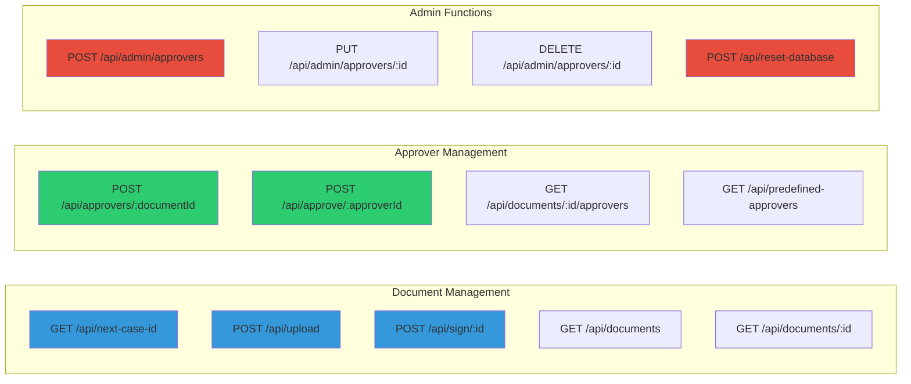
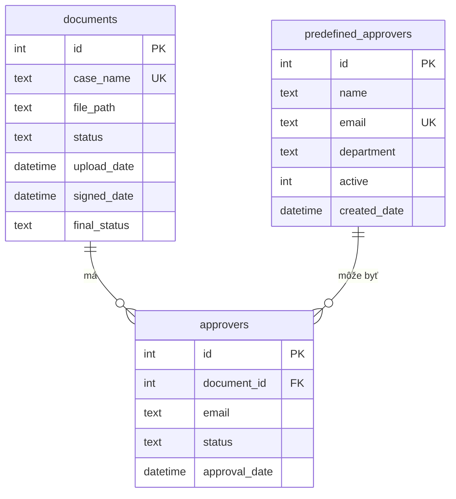
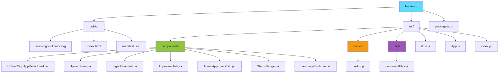

# Dokumentácia - Systém na správu dokumentov a schvaľovací proces

## Obsah
1. [Úvod](#úvod)
2. [Prehľad aplikácie](#prehľad-aplikácie)
3. [Základný workflow](#základný-workflow)
4. [Popis obrazoviek](#popis-obrazoviek)
5. [Funkcionalita](#funkcionalita)
6. [Administrácia](#administrácia)
7. [Technický popis](#technický-popis)
8. [Inštalácia a spustenie](#inštalácia-a-spustenie)

---

## Úvod

**Systém na správu dokumentov a schvaľovací proces** je webová aplikácia určená na komplexnú správu dokumentov vrátane nahrávania, elektronického podpisovania a procesu schvaľovania viacerými subjektmi.

### Hlavné funkcie:
- 📤 Nahrávanie PDF dokumentov
- 🔄 Nahradenie dokumentov v Draft stave
- ✍️ Elektronické podpisovanie dokumentov
- 👥 Správa schvaľovateľov
- ✅ Workflow schvaľovacieho procesu
- 📊 Prehľad všetkých dokumentov a ich stavov
- 🌐 Multijazyčnosť (slovenčina/angličtina)
- 🔧 Administrácia predefinovaných schvaľovateľov

---

## Prehľad aplikácie

### Architektúra
- **Frontend:** React.js s hooks a internationalization
- **Backend:** Node.js + Express.js
- **Databáza:** SQLite
- **PDF spracovanie:** pdf-lib
- **Upload súborov:** Multer

### Používatelia
Systém má dva typy funkcií:
1. **Bežný používateľ** - nahrávanie, podpisovanie, pridávanie schvaľovateľov
2. **Administrátor** - správa databázy predefinovaných schvaľovateľov

---

## Základný workflow

### Kompletný proces spracovania dokumentu:



### Stavy dokumentu:

| Stav | Popis | Možné akcie |
|------|-------|-------------|
| **Draft** | Počiatočný stav po nahratí | Nahradiť súbor, Podpísať |
| **Signed** | Elektronicky podpísaný | Pridať schvaľovateľov |
| **Waiting for Approval** | Čaká na schválenie | Schvaľovatelia rozhodujú |
| **Final Approved** | Všetci schválili | Finálny stav (uzamknutý) |
| **Rejected** | Zamietnutý | Finálny stav (uzamknutý) |

---

## Popis obrazoviek

Aplikácia obsahuje 6 hlavných záložiek:

### 1. 📤 Upload dokumentu

**Účel:** Nahratie nového dokumentu alebo nahradenie existujúceho

**Funkcie:**
- Nahratie PDF súboru (drag & drop alebo výber)
- Automatické generovanie Case ID (000001, 000002, ...)
- Pridanie komentára k dokumentu
- Zobrazenie úspešného nahrania

**Zobrazenie po nahratí:**
- Informácia o nahratom dokumente
- ID dokumentu a Case ID
- Možnosť nahradiť súbor (len v Draft stave)

**Nahradenie súboru:**
- Zobrazuje sa len ak je dokument v stave Draft
- Umožňuje vybrať nový PDF súbor
- Zachováva Case ID a dokumentové ID
- Pridanie komentára k zmene

### 2. ✍️ Podpísanie dokumentu

**Účel:** Elektronické podpísanie dokumentu

**Funkcie:**
- Zobrazenie informácií o dokumente
- Tlačidlo "Podpísať dokument"
- Pridanie elektronického podpisu do PDF
- Pridanie metadata (dátum, čas, Case ID)
- Pridanie číslovania strán s podpisom

**Podpisový text obsahuje:**
- Text: "Podpísané elektronicky (Prototyp)"
- Case ID dokumentu
- Dátum a čas podpísania
- Číslo strany / celkový počet strán

**Po podpísaní:**
- Status sa zmení na "Signed"
- Dokument je uzamknutý proti zmenám súboru
- Dokument je pripravený na pridanie schvaľovateľov

### 3. 👥 Pridanie schvaľovateľov

**Účel:** Priradenie schvaľovateľov k dokumentu

**Dve metódy pridania:**

#### A) Dynamický výber (odporúčaný)
- Klik na "➕ Pridať schvaľovateľa"
- Výber zo zoznamu predefinovaných schvaľovateľov
- Zobrazenie: meno, email, oddelenie
- Možnosť pridať viacero schvaľovateľov
- Možnosť odstrániť vybraných schvaľovateľov

#### B) Manuálne zadanie
- Textarea pre zadanie emailov
- Formáty: nový riadok, čiarka, bodkočiarka
- Hromadné pridanie viacerých emailov

**Informačné správy:**
- ✅ **Draft stav:** "Najprv musíte dokument podpísať"
- ✅ **Signed stav:** Možnosť pridať schvaľovateľov
- ⚠️ **Waiting for Approval:** "Schvaľovanie v procese - nemožno meniť"
- 🔒 **Final Approved/Rejected:** "Dokument uzamknutý"

**Po pridaní schvaľovateľov:**
- Status sa zmení na "Waiting for Approval"
- Vygenerujú sa simulačné linky pre testovanie
- Zoznam schvaľovateľov je uzamknutý

### 4. 📋 História a stav schvaľovania

**Účel:** Zobrazenie detailných informácií o dokumente

**Zobrazené informácie:**

#### Základné informácie:
- Case ID
- Pôvodný názov súboru
- Komentár
- Dátum nahrania
- Dátum podpísania (ak je podpísaný)

#### Časová os procesu:
- 📤 **Upload** - dátum a čas nahrania
- ✍️ **Podpísanie** - dátum a čas podpísania
- 👥 **Schvaľovanie** - počet schvaľovateľov a stav

#### História schvaľovateľov:
- Zoznam všetkých schvaľovateľov
- Stav každého schvaľovateľa (Pending/Approved/Rejected)
- Dátum rozhodnutia
- Farebné označenie podľa stavu:
  - 🟢 Zelená = Schválené (Approved)
  - 🔴 Červená = Zamietnuté (Rejected)
  - 🟡 Žltá = Čakajúce (Pending)

#### Súhrn schvaľovania:
- Počet schválených
- Počet zamietnutých
- Počet čakajúcich

#### Simulácia schvaľovania:
- Tlačidlá pre testovanie (Schváliť/Zamietnuť)
- Zobrazujú sa len počas testovania
- Po rozhodnutí sa aktualizuje stav

#### Link na stiahnutie:
- Odkaz na zobrazenie/stiahnutie dokumentu
- Otvorenie v novom okne
- Zobrazenie aktuálnej verzie PDF

### 5. 📊 Všetky dokumenty

**Účel:** Prehľad všetkých dokumentov v systéme

**Funkcie:**
- Načítanie zoznamu všetkých dokumentov
- Štatistiky podľa stavov
- Možnosť zobraziť detail dokumentu

**Štatistiky:**
- 🟢 **Schválené** - počet finálne schválených
- 🔴 **Zamietnuté** - počet zamietnutých
- 🟡 **Čaká na schválenie** - počet v procese
- ⚪ **Koncept** - počet Draft dokumentov

**Zoznam dokumentov obsahuje:**
- Case ID
- Názov súboru
- Status s farebným označením
- Dátum nahrania
- Tlačidlo "Zobraziť detail"

**Administračné funkcie:**
- 🔄 **Načítať dokumenty** - refresh zoznamu
- 🗑️ **Reset databázy** - vyčistenie všetkých dát (development)

### 6. ⚙️ Administrácia schvaľovateľov

**Účel:** Správa databázy predefinovaných schvaľovateľov

**Funkcie:**

#### Zobrazenie schvaľovateľov:
- Tabuľka všetkých schvaľovateľov
- Stĺpce: Meno, Email, Oddelenie, Status
- Farebné označenie aktívnych/neaktívnych

#### Pridanie nového schvaľovateľa:
- Formulár s poliami:
  - Meno (povinné)
  - Email (povinný, unikátny)
  - Oddelenie (povinné)
- Validácia emailu
- Kontrola duplicít

#### Úprava schvaľovateľa:
- Klik na "Upraviť"
- Formulár s predvyplnenými hodnotami
- Možnosť zmeniť všetky údaje
- Možnosť deaktivovať/aktivovať

#### Zmazanie schvaľovateľa:
- Dve možnosti:
  - **Deaktivácia** (soft delete) - zostane v DB, ale nie je viditeľný
  - **Trvalé zmazanie** (hard delete) - odstránenie z DB

**Predvolení schvaľovatelia:**
Systém obsahuje 8 predvolených schvaľovateľov:
- Ján Novák (Riaditeľstvo)
- Mária Svobodová (Právne oddelenie)
- Peter Horváth (Financie)
- Anna Kováčová (HR)
- Milan Dvořák (IT)
- Eva Procházková (Marketing)
- Tomáš Černý (Predaj)
- Zuzana Varga (Kvalita)

---

## Funkcionalita

### 1. Správa dokumentov

#### Nahrávanie súborov
- **Podporované formáty:** PDF
- **Maximálna veľkosť:** Neobmedzená (môže byť konfigurovaná)
- **Úložisko:** Lokálny priečinok `/uploads`
- **Názov súboru:** `{CaseID}.pdf` (napr. `000001.pdf`)
- **Automatické Case ID:** Sekvenčné číslovanie od 000001

#### Nahradenie súboru
- **Podmienka:** Dokument musí byť v stave Draft
- **Proces:**
  1. Výber nového PDF súboru
  2. Potvrdenie akce používateľom
  3. Zmazanie starého súboru
  4. Skopírovanie nového súboru
  5. Zachovanie Case ID a dokumentového ID
  6. Aktualizácia databázy
- **Validácia:** Kontrola existencie dočasného súboru
- **Error handling:** Rollback pri chybe

#### Metadata dokumentu
Ukladané informácie:
- `id` - Primárny kľúč (auto-increment)
- `case_name` - Case ID (unikátne)
- `original_filename` - Pôvodný názov súboru
- `file_path` - Cesta k súboru na disku
- `comment` - Komentár používateľa
- `status` - Aktuálny stav dokumentu
- `upload_date` - Dátum a čas nahrania
- `signed_date` - Dátum a čas podpísania

### 2. Elektronické podpisovanie

#### Proces podpísania:
1. Načítanie existujúceho PDF súboru
2. Použitie knižnice pdf-lib
3. Pridanie textového podpisu na každú stranu:
   - Pozícia: Spodok strany (y=30)
   - Text: "Podpísané elektronicky (Prototyp) | ID: {CaseID} | {Dátum a čas}"
   - Font: Helvetica, veľkosť 9
   - Farba: Modrá (rgb(0, 0.53, 0.71))
4. Pridanie číslovania strán:
   - Pozícia: Ešte nižšie (y=15)
   - Text: "Strana {X}/{Celkom} - Elektronicky podpísané"
   - Font: Helvetica, veľkosť 8
   - Farba: Sivá
5. Uloženie podpísaného PDF (prepísanie originálneho súboru)
6. Uzamknutie dokumentu - zmena statusu na "Signed"
7. Uloženie dátumu a času podpísania do DB

#### Vlastnosti:
- ✅ Podpis sa pridá na všetky strany
- ✅ Zachovanie pôvodného obsahu PDF
- ✅ Nemožnosť úpravy po podpísaní
- ✅ Trvalý záznam dátumu a času

### 3. Schvaľovací proces

#### Pridanie schvaľovateľov
**Metóda 1: Dynamický výber**
- Dropdown so zoznamom predefinovaných schvaľovateľov
- Filtrovanie len aktívnych schvaľovateľov
- Možnosť pridať viacero schvaľovateľov
- Zobrazenie detailov: meno, email, oddelenie

**Metóda 2: Manuálne zadanie**
- Textarea pre zadanie emailov
- Podporované oddeľovače: nový riadok, čiarka, bodkočiarka
- Automatické parsovanie a čistenie emailov

#### Proces schvaľovania
1. **Pridanie schvaľovateľov:**
   - Vloženie do tabuľky `approvers`
   - Generovanie unikátneho approval tokenu
   - Status: "Pending"
   - Zmena statusu dokumentu na "Waiting for Approval"

2. **Simulácia schválenia (testovanie):**
   - Vygenerovanie linkov pre každého schvaľovateľa
   - Tlačidlá "Schváliť" / "Zamietnuť"
   - Klik na tlačidlo aktualizuje status schvaľovateľa

3. **Kontrola finálneho statusu:**
   - **Po každom rozhodnutí** sa kontroluje celkový stav
   - **Ak všetci schválili** → Status: "Final Approved"
   - **Ak aspoň jeden zamietol** → Status: "Rejected"
   - **Inak** → Status: "Waiting for Approval"

4. **Pridanie finálneho obrázku:**
   - Pri "Final Approved" → Pridá sa `approved.jpg`
   - Pri "Rejected" → Pridá sa `rejected.png`
   - Obrázok sa pridá ako nová strana v PDF
   - Obsahuje text, dátum a centrovaný obrázok

#### API endpointy:
- `POST /api/approvers/:documentId` - Pridanie schvaľovateľov
- `POST /api/approve/:approverId` - Schválenie/zamietnutie

### 4. Multijazyčnosť

#### Podporované jazyky:
- 🇸🇰 **Slovenčina** (predvolený)
- 🇬🇧 **Angličtina**

#### Implementácia:
- Knižnica: `react-i18next`
- Súbor s prekladmi: `src/i18n.js`
- Prepínač jazyka v pravom hornom rohu
- Uloženie preferencie v localStorage
- Dynamické prepínanie bez refresh-u

#### Preložené texty:
- Všetky názvy záložiek
- Popisky formulárov
- Chybové správy
- Tlačidlá a akcie
- Informačné správy
- Stavy dokumentov

---

## Administrácia

### Správa predefinovaných schvaľovateľov

#### Prístup:
- Záložka "⚙️ Administrácia schvaľovateľov"
- Dostupná pre všetkých používateľov (v produkčnom prostredí by mala byť chránená)

#### Funkcie administrátora:

##### 1. Zobrazenie schvaľovateľov
```
| Meno | Email | Oddelenie | Status | Akcie |
|------|-------|-----------|--------|-------|
```
- Tabuľka s prehľadom všetkých schvaľovateľov
- Filter: aktívni / neaktívni
- Farebné označenie statusu

##### 2. Pridanie schvaľovateľa
**Formulár:**
- **Meno:** Text (povinné)
- **Email:** Email (povinný, unikátny)
- **Oddelenie:** Text (povinné)

**Validácia:**
- Kontrola povinných polí
- Validácia formátu emailu
- Kontrola duplicitného emailu
- Chybové správy pri neúspešnom pridaní

**API:**
```
POST /api/admin/approvers
Body: { name, email, department }
```

##### 3. Úprava schvaľovateľa
**Proces:**
1. Klik na "✏️ Upraviť"
2. Formulár s predvyplnenými hodnotami
3. Zmena údajov
4. Uloženie

**API:**
```
PUT /api/admin/approvers/:id
Body: { name, email, department, active }
```

##### 4. Zmazanie/Deaktivácia
**Dve možnosti:**

**A) Deaktivácia (soft delete):**
- Schvaľovateľ zostáva v databáze
- Pole `active` = 0
- Nezobrazuje sa v zozname pri výbere
- Možnosť reaktivovať

**API:**
```
DELETE /api/admin/approvers/:id
```

**B) Trvalé zmazanie (hard delete):**
- Odstránenie z databázy
- Nevratná operácia
- Používať opatrne

**API:**
```
DELETE /api/admin/approvers/:id?permanent=true
```

### Reset databázy (Development)

**Účel:** Vyčistenie všetkých testovacích dát

**Funkcia:**
- Tlačidlo "🗑️ Reset databázy" na záložke "Všetky dokumenty"
- Vyžaduje potvrdenie

**Proces:**
1. Zmazanie všetkých záznamov z tabuľky `approvers`
2. Zmazanie všetkých záznamov z tabuľky `documents`
3. Reset AUTOINCREMENT počítadiel
4. Zmazanie všetkých súborov z priečinka `/uploads`
5. Zachovanie tabuľky `predefined_approvers`

**API:**
```
POST /api/reset-database
```

**⚠️ Upozornenie:** V produkčnom prostredí by táto funkcia mala byť odstránená alebo chránená!

---

## Technický popis

### Backend (Node.js + Express)

#### Hlavný súbor: `server.js`

**Middleware:**
- `cors()` - Povoľovanie cross-origin requestov
- `express.json()` - Parsovanie JSON tela
- `express.static()` - Statické súbory z `/uploads`
- `multer()` - Upload súborov

**Konfigurácia Multer:**
```javascript
const storage = multer.diskStorage({
    destination: './uploads',
    filename: (req, file, cb) => {
        const uniqueSuffix = Date.now() + '-' + Math.round(Math.random() * 1E9);
        cb(null, uniqueSuffix + '-' + file.originalname);
    }
});
```

#### REST API Endpointy:



| Metóda | Endpoint | Popis |
|--------|----------|-------|
| GET | `/api/next-case-id` | Získanie nasledujúceho Case ID |
| POST | `/api/upload` | Upload nového dokumentu alebo nahradenie |
| POST | `/api/sign/:documentId` | Podpísanie dokumentu |
| POST | `/api/approvers/:documentId` | Pridanie schvaľovateľov |
| POST | `/api/approve/:approverId` | Schválenie/zamietnutie |
| GET | `/api/document/:documentId` | Detail dokumentu |
| GET | `/api/documents` | Zoznam všetkých dokumentov |
| GET | `/api/predefined-approvers` | Aktívni schvaľovatelia |
| GET | `/api/admin/approvers` | Všetci schvaľovatelia (admin) |
| POST | `/api/admin/approvers` | Pridať schvaľovateľa |
| PUT | `/api/admin/approvers/:id` | Upraviť schvaľovateľa |
| DELETE | `/api/admin/approvers/:id` | Zmazať/deaktivovať schvaľovateľa |
| POST | `/api/reset-database` | Reset databázy (dev) |

#### Spracovanie PDF:
**Knižnica:** pdf-lib

**Funkcie:**
- `PDFDocument.load()` - Načítanie existujúceho PDF
- `pdfDoc.embedFont()` - Nastavenie fontu
- `page.drawText()` - Pridanie textu
- `pdfDoc.embedJpg/embedPng()` - Pridanie obrázku
- `pdfDoc.addPage()` - Pridanie novej strany
- `pdfDoc.save()` - Uloženie PDF

**Príklad použitia:**
```javascript
const existingPdfBytes = await fs.readFile(filePath);
const pdfDoc = await PDFDocument.load(existingPdfBytes);
const font = await pdfDoc.embedFont(StandardFonts.Helvetica);

pages.forEach((page) => {
    page.drawText(signatureText, {
        x: 50,
        y: 30,
        size: 9,
        font: font,
        color: rgb(0, 0.53, 0.71)
    });
});

const signedPdfBytes = await pdfDoc.save();
await fs.writeFile(filePath, signedPdfBytes);
```

### Databáza (SQLite)

#### Hlavný súbor: `database.js`

**Databázový súbor:** `db.sqlite`

#### Tabuľky:

##### 1. `documents`
```sql
CREATE TABLE documents (
    id INTEGER PRIMARY KEY AUTOINCREMENT,
    case_name TEXT NOT NULL UNIQUE,
    original_filename TEXT NOT NULL,
    file_path TEXT NOT NULL,
    comment TEXT,
    status TEXT DEFAULT 'Draft',
    upload_date DATETIME DEFAULT CURRENT_TIMESTAMP,
    signed_date DATETIME
)
```

**Popis stĺpcov:**
- `id` - Unikátny identifikátor dokumentu
- `case_name` - Case ID (000001, 000002, ...)
- `original_filename` - Pôvodný názov súboru od používateľa
- `file_path` - Absolútna cesta k súboru na disku
- `comment` - Voliteľný komentár
- `status` - Draft/Signed/Waiting for Approval/Final Approved/Rejected
- `upload_date` - Automatický timestamp pri vytvorení
- `signed_date` - Timestamp pri podpísaní

##### 2. `approvers`
```sql
CREATE TABLE approvers (
    id INTEGER PRIMARY KEY AUTOINCREMENT,
    document_id INTEGER NOT NULL,
    approver_email TEXT NOT NULL,
    approval_status TEXT DEFAULT 'Pending',
    approval_date DATETIME,
    FOREIGN KEY (document_id) REFERENCES documents(id)
)
```

**Popis stĺpcov:**
- `id` - Unikátny identifikátor schvaľovateľa
- `document_id` - FK na documents.id
- `approver_email` - Email schvaľovateľa
- `approval_status` - Pending/Approved/Rejected
- `approval_date` - Timestamp rozhodnutia

##### 3. `predefined_approvers`
```sql
CREATE TABLE predefined_approvers (
    id INTEGER PRIMARY KEY AUTOINCREMENT,
    name TEXT NOT NULL,
    email TEXT NOT NULL UNIQUE,
    department TEXT NOT NULL,
    active INTEGER DEFAULT 1,
    created_date DATETIME DEFAULT CURRENT_TIMESTAMP
)
```

**Popis stĺpcov:**
- `id` - Unikátny identifikátor
- `name` - Celé meno schvaľovateľa
- `email` - Unikátny email
- `department` - Oddelenie/pozícia
- `active` - 1 = aktívny, 0 = deaktivovaný
- `created_date` - Dátum pridania

#### Databázové vzťahy



### Frontend (React.js)

#### Štruktúra projektu:



#### Hlavné komponenty:

##### 1. `UploadSignAppRefactored.jsx`
**Účel:** Hlavný wrapper komponent

**State management:**
- `documentId` - ID aktuálneho dokumentu
- `caseName` - Case ID dokumentu
- `uploadStatus` - Stavové správy
- `history` - Detail dokumentu
- `allDocuments` - Zoznam všetkých dokumentov
- `activeTab` - Aktívna záložka
- `selectedApprovers` - Vybraní schvaľovatelia
- `approvalLinks` - Simulačné linky

**Kľúčové funkcie:**
- `loadNextCaseId()` - Načítanie ďalšieho Case ID
- `handleUploadSuccess()` - Spracovanie úspešného uploadu
- `handleSignSuccess()` - Spracovanie podpísania
- `handleViewHistory()` - Načítanie histórie
- `handleReplaceDocument()` - Nahradenie súboru

##### 2. `UploadForm.jsx`
**Účel:** Formulár pre upload a nahradenie dokumentu

**Props:**
- `caseName` - Case ID
- `onUploadSuccess` - Callback po úspešnom upload
- `documentId` - ID dokumentu (pre nahradenie)
- `history` - História dokumentu
- `onReplaceDocument` - Callback po nahradení

**Logika nahradenia:**
```javascript
if (documentId && history?.status === 'Draft') {
    // Zobraz formulár pre nahradenie
} else if (documentId) {
    // Zobraz info o dokumente
} else {
    // Zobraz formulár pre nový upload
}
```

##### 3. `ApproversTab.jsx`
**Účel:** Správa schvaľovateľov

**Podmienky:**
- `canAddApprovers` - Dokument je Signed a nemá schvaľovateľov
- `canModifyApprovers` - Dokument je Signed a nie je v procese
- `isApprovalInProgress` - Dokument čaká na schválenie
- `isApprovalCompleted` - Dokument je finálne schválený/zamietnutý

**Dynamický výber:**
- Dropdown s predefinovanými schvaľovateľmi
- Možnosť pridať viacero riadkov
- Odstránenie vybraných schvaľovateľov

##### 4. `useApi.js` Custom Hook
**Účel:** Komunikácia s backend API

**Poskytuje:**
- `loading` - Boolean stav načítavania
- `error` - Chybová správa
- `get(url)` - GET request
- `post(url, data)` - POST request
- `put(url, data)` - PUT request
- `delete(url)` - DELETE request

**Použitie:**
```javascript
const api = useApi();

const response = await api.post('/upload', formData);
```

##### 5. `documentUtils.js`
**Helper funkcie:**

```javascript
// Farba podľa statusu
getStatusColor(status)

// Farba karty schvaľovateľa
getApproverCardColor(status)

// Formátovanie dátumu
formatDate(dateString)
```

#### Styling

**Hlavný súbor:** `components/UploadSignApp.css`

**Témy farieb:**
- Primárna: `#007bff` (Modrá)
- Úspech: `#28a745` (Zelená)
- Varovanie: `#ffc107` (Žltá)
- Chyba: `#dc3545` (Červená)
- Info: `#17a2b8` (Tyrkysová)

**Komponenty:**
- `.app-container` - Hlavný wrapper
- `.tab-navigation` - Navigácia záložiek
- `.tab-button` - Tlačidlo záložky
- `.form-container` - Wrapper formulára
- `.card` - Karta pre obsah
- `.btn` - Tlačidlo (rôzne varianty)
- `.alert` - Upozornenie
- `.status-badge` - Badge pre status

### Závislosti

#### Backend (`package.json`):
```json
{
  "dependencies": {
    "cors": "^2.8.5",
    "express": "^5.1.0",
    "multer": "^2.0.2",
    "pdf-lib": "^1.17.1",
    "sqlite3": "^5.1.7"
  }
}
```

#### Frontend (`package.json`):
```json
{
  "dependencies": {
    "axios": "^1.12.2",
    "i18next": "^25.6.0",
    "react": "^19.2.0",
    "react-dom": "^19.2.0",
    "react-i18next": "^16.0.1",
    "react-scripts": "5.0.1"
  }
}
```

---

## Inštalácia a spustenie

### Požiadavky
- **Node.js** 18+ (odporúčané: najnovšia LTS verzia)
- **npm** alebo **yarn**
- **Windows/Linux/macOS**

### Inštalácia

#### 1. Klonovanie/stiahnutie projektu
```bash
cd /path/to/project
```

#### 2. Inštalácia backend závislostí
```bash
npm install
```

#### 3. Inštalácia frontend závislostí
```bash
cd frontend
npm install
cd ..
```

### Spustenie

#### Development režim:

**1. Spustenie backendu:**
```bash
npm start
```
- Server beží na `http://localhost:3001`
- API dostupné na `http://localhost:3001/api`

**2. Spustenie frontendu (v novom terminále):**
```bash
cd frontend
npm start
```
- Aplikácia beží na `http://localhost:3000`
- Automatické otvorenie v prehliadači
- Hot-reload pri zmenách kódu

#### Production build:

**1. Build frontendu:**
```bash
cd frontend
npm run build
cd ..
```
- Vytvorí optimalizovaný build v `frontend/build/`

**2. Spustenie production servera:**
- Backend slúži statické súbory z `frontend/build/`
- Všetko beží na porte 3001

### Štruktúra priečinkov po inštalácii:

```
Microhack/
├── database.js              # SQLite pripojenie
├── db.sqlite                # Databázový súbor (vytvorí sa auto)
├── server.js                # Express server
├── package.json             # Backend závislosti
├── uploads/                 # Nahraté dokumenty (vytvorí sa auto)
├── images/                  # Obrázky pre PDF (approved/rejected)
│   ├── approved.jpg
│   ├── rejected.png
│   └── seas-logo-fullcolor.svg
├── frontend/
│   ├── src/                 # React zdrojové súbory
│   ├── public/              # Statické súbory
│   ├── build/               # Production build (po npm run build)
│   └── package.json         # Frontend závislosti
└── DOKUMENTACIA.md          # Tento súbor
```

### Konfigurácia

#### Backend (`server.js`):
```javascript
const PORT = 3001;                    // Port servera
const UPLOAD_DIR = './uploads';       // Priečinok pre súbory
const API_BASE_URL = '/api';          // Base URL pre API
```

#### Frontend (`useApi.js`):
```javascript
const API_BASE_URL = 'http://localhost:3001/api';
```

**⚠️ Poznámka:** Pri nasadení na production je potrebné zmeniť API_BASE_URL na reálnu URL servera.

### Testovanie

#### Základný test workflow:

1. **Otvorte aplikáciu:** `http://localhost:3000`
2. **Upload dokumentu:**
   - Záložka "Upload dokumentu"
   - Vyberte PDF súbor
   - Klik "📤 Nahrať dokument"
3. **Podpísanie:**
   - Záložka "Podpísanie dokumentu"
   - Klik "✍️ Podpísať dokument"
4. **Pridanie schvaľovateľov:**
   - Záložka "Pridať schvaľovateľov"
   - Vyberte schvaľovateľov alebo zadajte emaily
   - Klik "Pridať schvaľovateľov"
5. **Simulácia schvaľovania:**
   - Záložka "História a stav"
   - Použite tlačidlá "Schváliť"/"Zamietnuť"
6. **Kontrola výsledku:**
   - Pozrite sa na finálny status
   - Stiahnite PDF a skontrolujte finálny obrázok

### Riešenie problémov

#### Backend sa nespustí:
- Skontrolujte či je port 3001 voľný: `netstat -ano | findstr :3001`
- Skontrolujte logs v konzole
- Skontrolujte či sú nainštalované závislosti: `npm install`

#### Frontend sa nespustí:
- Skontrolujte či je port 3000 voľný
- Vyčistite cache: `cd frontend && npm cache clean --force`
- Reinstalujte závislosti: `rm -rf node_modules && npm install`

#### CORS chyby:
- Backend musí bežať na porte 3001
- Skontrolujte konfiguráciu CORS v `server.js`

#### Upload nefunguje:
- Skontrolujte či existuje priečinok `uploads/`
- Skontrolujte práva na zápis do priečinka
- Skontrolujte API logs v konzole backendu

#### PDF podpis nefunguje:
- Skontrolujte či je nainštalovaná knižnica `pdf-lib`
- Skontrolujte či súbor existuje v `uploads/`
- Pozrite sa na error v backend konzole

---

## Rozšírenia a budúci vývoj

### Možné vylepšenia:

#### Bezpečnosť:
- 🔐 Autentifikácia používateľov (JWT)
- 🔐 Autorizácia na základe rolí
- 🔐 Šifrovanie dokumentov
- 🔐 Rate limiting pre API
- 🔐 HTTPS v produkcii

#### Funkcionalita:
- 📧 Reálne posielanie emailov schvaľovateľom
- 🔔 Notifikácie pri zmenách statusu
- 📝 Audit log všetkých akcií
- 🔍 Fulltextové vyhľadávanie v dokumentoch
- 📊 Dashboard so štatistikami
- 🗂️ Kategorizácia dokumentov
- 📎 Prílohy k dokumentom
- 💬 Komentáre a diskusia k dokumentom

#### Používateľské rozhranie:
- 📱 Mobilná responzívna verzia
- 🎨 Customizovateľné témy
- ♿ Zlepšenie prístupnosti (ARIA)
- 🖱️ Drag & drop upload
- 📋 Bulk operácie
- 🔖 Záložky a obľúbené dokumenty

#### Technické:
- 🐳 Docker containerizácia
- 🧪 Unit a integration testy
- 📝 OpenAPI/Swagger dokumentácia
- 🔄 CI/CD pipeline
- 📊 Monitoring a logging (Winston, Morgan)
- 💾 Migrácia na PostgreSQL/MongoDB
- ☁️ Cloud storage (AWS S3, Azure Blob)

---

## Licencia a kontakt

**Projekt:** Systém na správu dokumentov a schvaľovací proces  
**Verzia:** 1.0.0  
**Dátum:** Október 2025  
**Autor:** [Vaše meno/firma]  

**Technická podpora:**  
Email: support@example.com  
Web: https://example.com  

---

## Prílohy

### A. Zoznam všetkých API endpointov

```
GET    /api/next-case-id                  Získanie nasledujúceho Case ID
POST   /api/upload                         Upload/nahradenie dokumentu
POST   /api/sign/:documentId               Podpísanie dokumentu
POST   /api/approvers/:documentId          Pridanie schvaľovateľov
POST   /api/approve/:approverId            Schválenie/zamietnutie
GET    /api/document/:documentId           Detail dokumentu
GET    /api/documents                      Zoznam dokumentov
GET    /api/predefined-approvers           Aktívni schvaľovatelia
GET    /api/admin/approvers                Všetci schvaľovatelia
POST   /api/admin/approvers                Pridať schvaľovateľa
PUT    /api/admin/approvers/:id            Upraviť schvaľovateľa
DELETE /api/admin/approvers/:id            Zmazať schvaľovateľa
POST   /api/reset-database                 Reset databázy
```

### B. Stavy dokumentu a ich význam

| Stav | Slovensky | Anglicky | Popis |
|------|-----------|----------|-------|
| Draft | Koncept | Draft | Počiatočný stav, možnosť úpravy |
| Signed | Podpísaný | Signed | Elektronicky podpísaný |
| Waiting for Approval | Čaká na schválenie | Waiting for Approval | V procese schvaľovania |
| Final Approved | Finálne schválené | Final Approved | Všetci schválili |
| Rejected | Zamietnuté | Rejected | Aspoň jeden zamietol |

### C. Farebné kódovanie

**Stavy dokumentov:**
- 🟢 **Zelená (#28a745):** Signed, Final Approved
- 🔴 **Červená (#dc3545):** Rejected
- 🟡 **Žltá (#ffc107):** Waiting for Approval
- ⚪ **Sivá (#6c757d):** Draft

**Stavy schvaľovateľov:**
- 🟢 **Zelená (#d4edda):** Approved
- 🔴 **Červená (#f8d7da):** Rejected
- 🟡 **Žltá (#fff3cd):** Pending

### D. Formáty dátumov

**Databáza (SQLite):**
```
YYYY-MM-DD HH:MM:SS
Príklad: 2025-10-18 14:30:45
```

**Frontend zobrazenie:**
```
DD.MM.YYYY HH:MM:SS
Príklad: 18.10.2025 14:30:45
```

---

**Koniec dokumentácie**  
*Posledná aktualizácia: Október 2025*
