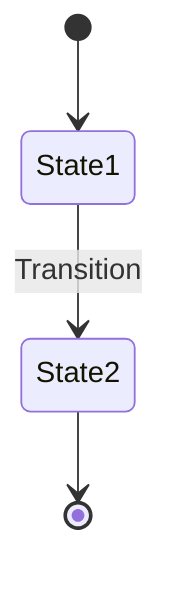
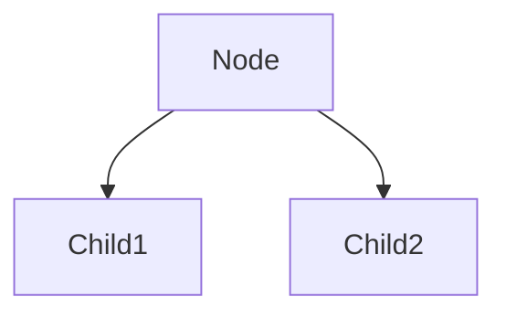
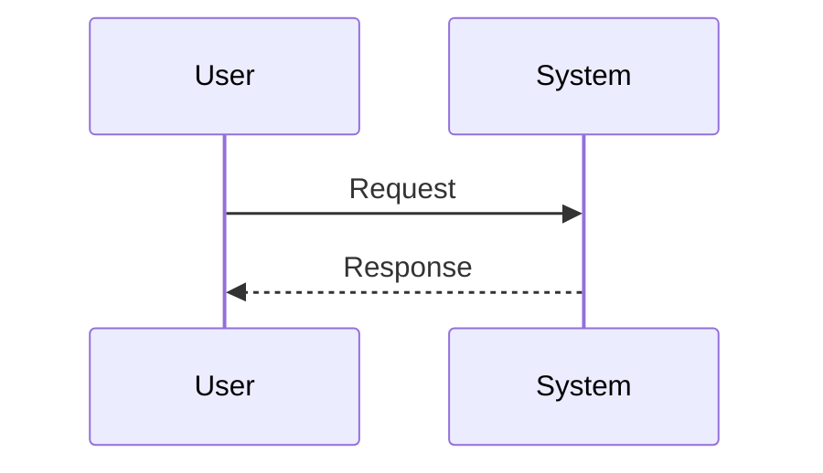
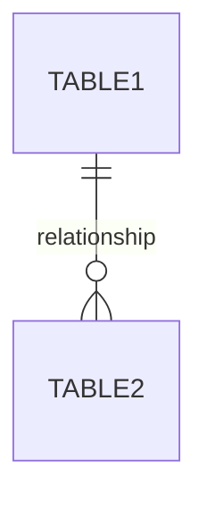
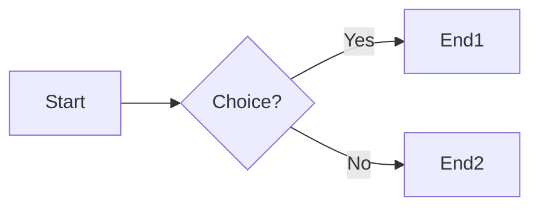

# Mermaid Diagrams - Prehľad

Tento dokument obsahuje zoznam všetkých Mermaid diagramov použitých v projektovej dokumentácii.

## 📊 Zoznam diagramov

### 1. DOKUMENTACIA.md

#### 1.1 Workflow diagram
- **Typ:** State Diagram
- **Umiestnenie:** Základný workflow
- **Popis:** Zobrazuje stavy dokumentu (Draft → Signed → Waiting → Final)
- **Využitie:** Vizualizácia životného cyklu dokumentu

#### 1.2 Frontend štruktúra
- **Typ:** Graph/Tree Diagram
- **Umiestnenie:** Frontend štruktúra projektu
- **Popis:** Hierarchia súborov a komponentov
- **Využitie:** Pochopenie organizácie frontend kódu

#### 1.3 API Endpoints
- **Typ:** Graph Diagram
- **Umiestnenie:** REST API Endpointy
- **Popis:** Kategorizácia API endpointov (Document, Approver, Admin)
- **Využitie:** Rýchly prehľad dostupných API

#### 1.4 Databázové vzťahy
- **Typ:** Entity-Relationship Diagram (ERD)
- **Umiestnenie:** Databázové vzťahy
- **Popis:** Vzťahy medzi tabuľkami (documents, approvers, predefined_approvers)
- **Využitie:** Pochopenie dátového modelu

---

### 2. DESIGN_DOCUMENT.md

#### 2.1 System Architecture
- **Typ:** Graph Diagram s Subgraphs
- **Umiestnenie:** High-Level Architecture
- **Popis:** 3-vrstvová architektúra (Frontend, Backend, Persistence)
- **Využitie:** Celkový prehľad systémovej architektúry

#### 2.2 Component Hierarchy
- **Typ:** Tree Diagram
- **Umiestnenie:** Component Design
- **Popis:** Hierarchia React komponentov
- **Využitie:** Pochopenie štruktúry UI komponentov

#### 2.3 Document Signing Flow
- **Typ:** Sequence Diagram
- **Umiestnenie:** Data Flow - Document Signing
- **Popis:** Interakcia User → Frontend → Backend → PDF-lib → Database
- **Využitie:** Pochopenie procesu podpisovania

---

### 3. agents.md

#### 3.1 Štruktúra projektu
- **Typ:** Graph/Tree Diagram
- **Umiestnenie:** Projektový Kontext
- **Popis:** Kompletná štruktúra priečinkov a súborov
- **Využitie:** Orientácia v projekte pre AI agentov

---

### 4. TESTING.md

#### 4.1 Test Suites Overview
- **Typ:** Graph Diagram
- **Umiestnenie:** Obsah testov
- **Popis:** 4 test suites s ich podtestami
- **Využitie:** Prehľad testovacej pokrytosti

---

### 5. AZURE_DEPLOYMENT.md

#### 5.1 Azure Architecture
- **Typ:** Graph Diagram s Subgraphs
- **Umiestnenie:** Úvod
- **Popis:** Azure resources (App Service, Storage, CDN, GitHub Actions)
- **Využitie:** Pochopenie Azure deployment architektúry

#### 5.2 Deployment Process
- **Typ:** Flowchart
- **Umiestnenie:** Manuálne nasadenie
- **Popis:** Kroky deployment skriptu od začiatku po koniec
- **Využitie:** Pochopenie deployment procesu

#### 5.3 GitHub Actions Workflow
- **Typ:** Flowchart
- **Umiestnenie:** Automatické nasadenie
- **Popis:** CI/CD pipeline kroky
- **Využitie:** Pochopenie automatizovaného deploymentu

#### 5.4 Storage Options
- **Typ:** Graph Diagram s Subgraphs
- **Umiestnenie:** Konfigurácia Storage
- **Popis:** Porovnanie Local vs Azure Blob Storage
- **Využitie:** Pochopenie storage abstrakcie

---

### 6. AZURE_CHANGELOG.md

#### 6.1 Architecture Comparison
- **Typ:** Graph Diagram s Subgraphs
- **Umiestnenie:** Architektúra
- **Popis:** Porovnanie PRED (local) vs PO (Azure)
- **Využitie:** Vizualizácia zmien v architektúre

#### 6.2 Storage Abstraction Layer
- **Typ:** Graph Diagram
- **Umiestnenie:** Architektúra
- **Popis:** Ako funguje storage abstraction (local/azure prepínanie)
- **Využitie:** Technické pochopenie storage layeru

---

## 🎨 Použité Mermaid syntax

### State Diagram


### Graph/Tree Diagram


### Sequence Diagram


### Entity-Relationship Diagram


### Flowchart


## 📝 Styling Guidelines

### Farby použité v diagramoch

```javascript
// Frontend komponenty
style ComponentName fill:#61dafb  // React modrá

// Backend komponenty
style ServerName fill:#90c53f     // Node.js zelená

// Databáza
style DatabaseName fill:#003b57   // SQLite tmavomodrá

// Azure služby
style AzureName fill:#0078d4      // Azure modrá

// Storage
style StorageName fill:#f39c12    // Oranžová

// Testy
style TestName fill:#e74c3c       // Červená

// GitHub
style GitHubName fill:#24292e     // GitHub čierna

// Success states
style SuccessName fill:#28a745    // Zelená

// Error states
style ErrorName fill:#dc3545      // Červená

// CDN
style CDNName fill:#00bcf2        // Svetlomodrá
```

## 🔧 Ako používať Mermaid

### V Markdown súboroch
```markdown
```mermaid
graph TD
    A[Start] --> B[End]
```​
```

### GitHub rendering
- ✅ GitHub automaticky renderuje Mermaid diagramy
- ✅ VS Code s Markdown Preview Mermaid Support extension
- ✅ GitLab natively supports Mermaid
- ✅ Notion, Confluence support Mermaid

### Online editory
- [Mermaid Live Editor](https://mermaid.live/)
- [Mermaid Chart](https://www.mermaidchart.com/)

## 📚 Dokumentácia

- [Mermaid Official Documentation](https://mermaid.js.org/)
- [Mermaid Syntax Reference](https://mermaid.js.org/intro/syntax-reference.html)
- [Examples Gallery](https://mermaid.js.org/ecosystem/integrations.html)

## 💡 Best Practices

### ✅ DO:
- Používaj jasné, popisné názvy uzlov
- Farby pre rozlíšenie typov komponentov
- Subgraphy pre logické zoskupenia
- Notes pre dodatočné vysvetlenia
- Konzistentné štýlovanie naprieč diagramami

### ❌ DON'T:
- Neprehusťuj diagram príliš veľa uzlami
- Nepoužívaj príliš dlhé texty v uzloch
- Nemiešaj rôzne typy diagramov v jednom
- Nezabúdaj na direction (TD, LR, etc.)

## 🎯 Prínos Mermaid diagramov

### Pre vývojárov:
- ✅ Rýchle pochopenie architektúry
- ✅ Vizuálna dokumentácia priamo v kóde
- ✅ Ľahké aktualizácie (text-based)
- ✅ Version control friendly

### Pre AI agentov:
- ✅ Štruktúrované informácie
- ✅ Jasné vzťahy medzi komponentmi
- ✅ Vizuálna navigácia
- ✅ Kontextové pochopenie

### Pre projekt management:
- ✅ Prehľad architektúry
- ✅ Dokumentácia workflow
- ✅ Onboarding nových členov
- ✅ Technická dokumentácia

---

## 📈 Štatistiky

**Celkový počet Mermaid diagramov:** 13

**Rozdelenie podľa typu:**
- Graph Diagrams: 8
- State Diagrams: 1
- Sequence Diagrams: 1
- ERD Diagrams: 2
- Flowcharts: 1

**Rozdelenie podľa dokumentu:**
- DOKUMENTACIA.md: 4 diagramy
- DESIGN_DOCUMENT.md: 3 diagramy
- AZURE_DEPLOYMENT.md: 4 diagramy
- AZURE_CHANGELOG.md: 2 diagramy
- agents.md: 1 diagram
- TESTING.md: 1 diagram

**Riadky Mermaid kódu:** ~400 riadkov

---

**Last updated:** October 21, 2025
