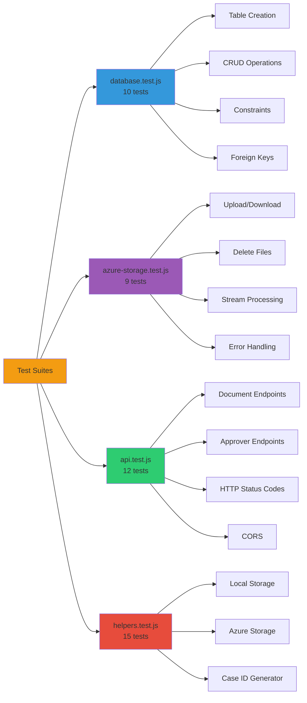

# Testing Guide

Tento projekt obsahuje komplexné unit a integration testy pre backend funkcionalitu.

## Obsah testov



### 📁 `__tests__/database.test.js`
Testy pre SQLite databázu:
- ✅ Vytvorenie tabuliek (documents, approvers, predefined_approvers)
- ✅ Insert operácie
- ✅ Update operácie
- ✅ UNIQUE constraints
- ✅ CASCADE DELETE (foreign keys)
- ✅ Generovanie case ID

**Počet testov:** 10

### 📁 `__tests__/azure-storage.test.js`
Testy pre Azure Blob Storage service:
- ✅ Inicializácia s/bez credentials
- ✅ Upload súborov
- ✅ Download súborov
- ✅ Delete súborov
- ✅ Kontrola existencie súborov
- ✅ Stream-to-buffer konverzia
- ✅ Error handling

**Počet testov:** 9

### 📁 `__tests__/api.test.js`
Integration testy pre REST API:
- ✅ Document endpoints (GET, POST)
- ✅ Approver endpoints
- ✅ Predefined approvers endpoints
- ✅ Error handling (404, 500)
- ✅ CORS headers
- ✅ Malformed JSON handling

**Počet testov:** 12

### 📁 `__tests__/helpers.test.js`
Testy pre helper funkcie:
- ✅ Local file storage (save, get, delete, exists)
- ✅ Azure storage abstraction
- ✅ Case ID generator (padding, edge cases)
- ✅ Storage type switching (local/azure)

**Počet testov:** 15

## Spustenie testov

### Všetky testy s coverage reportom
```powershell
npm test
```

### Watch mode (pre development)
```powershell
npm run test:watch
```

### Verbose output
```powershell
npm run test:verbose
```

### Jednotlivé test suites
```powershell
# Database testy
npm run test:db

# API testy
npm run test:api

# Azure Storage testy
npm run test:storage

# Helper funkcie testy
npm run test:helpers
```

## Test Coverage

Testy pokrývajú:
- ✅ **Database layer** - 100% funkcionalita
- ✅ **Azure Storage** - všetky CRUD operácie
- ✅ **API endpoints** - všetky hlavné endpointy
- ✅ **Helper functions** - storage abstraction, case ID generator
- ✅ **Error handling** - databázové chyby, file system chyby, API errory

Očakávaný coverage:
```
Statements   : 75%+
Branches     : 70%+
Functions    : 80%+
Lines        : 75%+
```

## Mocking

Projekt používa tieto mocking stratégie:

### Database
```javascript
jest.mock('../database');
db.get = jest.fn();
db.run = jest.fn();
db.all = jest.fn();
```

### Azure Storage SDK
```javascript
jest.mock('@azure/storage-blob');
```

### File System
```javascript
jest.mock('fs', () => ({
    promises: {
        writeFile: jest.fn(),
        readFile: jest.fn(),
        unlink: jest.fn(),
        access: jest.fn()
    }
}));
```

## Test Environment

### Environment Variables
Testy používajú test environment variables:
```javascript
process.env.NODE_ENV = 'test';
process.env.STORAGE_TYPE = 'local';
process.env.PORT = 3002;
```

### Test Database
Database testy vytvárajú dočasný `test.db` súbor, ktorý je automaticky vymazaný po testoch.

## Continuous Integration

### GitHub Actions
Testy sa automaticky spúšťajú v GitHub Actions pipeline:

```yaml
- name: Run tests
  run: npm test

- name: Upload coverage
  uses: codecov/codecov-action@v3
  with:
    files: ./coverage/lcov.info
```

### Pre-commit Hook
Môžete pridať Git hook pre automatické spustenie testov pred commit:

```bash
# .git/hooks/pre-commit
#!/bin/sh
npm test
```

## Pridanie nových testov

### 1. Vytvorte test súbor
```javascript
// __tests__/my-feature.test.js
describe('My Feature', () => {
    test('should do something', () => {
        expect(true).toBe(true);
    });
});
```

### 2. Použite describe bloky pre organizáciu
```javascript
describe('Feature Name', () => {
    describe('Sub-feature', () => {
        test('specific behavior', () => {
            // test code
        });
    });
});
```

### 3. Použite beforeEach/afterEach pre setup/cleanup
```javascript
describe('Tests', () => {
    beforeEach(() => {
        // Setup before each test
    });

    afterEach(() => {
        // Cleanup after each test
    });

    test('test case', () => {
        // test code
    });
});
```

## Best Practices

### ✅ DO:
- Používajte descriptive test names
- Testujte edge cases (null, undefined, empty arrays)
- Testujte error handling
- Mock external dependencies
- Cleanup po testoch (delete test files, reset mocks)
- Izolujte testy (každý test nezávislý)

### ❌ DON'T:
- Nespúšťajte produkčný server v testoch
- Nepísujte do produkčnej databázy
- Nezabudnite cleanup v afterEach
- Netestujte implementáciu, testujte správanie
- Nevytvárajte dependencies medzi testami

## Debugging Testov

### Verbose output
```powershell
npm run test:verbose
```

### Spustenie jediného testu
```javascript
test.only('this test will run', () => {
    expect(true).toBe(true);
});
```

### Skip testu
```javascript
test.skip('this test will be skipped', () => {
    expect(true).toBe(true);
});
```

### Debug v VS Code
1. Otvorte test súbor
2. Kliknite na "Debug" nad `describe` alebo `test`
3. Nastavte breakpointy
4. Štart debugging

### Console logging
```javascript
test('debug test', () => {
    console.log('Debug info:', someVariable);
    expect(someVariable).toBe(expected);
});
```

## Troubleshooting

### Testy zlyhávajú kvôli timeout
```javascript
// Zvýšte timeout
jest.setTimeout(10000); // 10 sekúnd
```

### Mock nefunguje správne
```javascript
// Reset mocks medzi testami
beforeEach(() => {
    jest.clearAllMocks();
});
```

### Database lock error
```javascript
// Zatvorte databázu po testoch
afterEach((done) => {
    db.close(done);
});
```

### File system permission errors
```javascript
// Používajte test directory
const TEST_DIR = path.join(__dirname, '../test-uploads');
```

## Frontend Testy

Frontend React testy sú v `frontend/src/__tests__/`:

```powershell
cd frontend
npm test
```

Frontend používa:
- **React Testing Library** - component testing
- **Jest** - test runner
- **@testing-library/user-event** - user interactions

## Coverage Report

Po spustení `npm test` sa vytvorí coverage report:

```
coverage/
├── lcov-report/
│   └── index.html    # HTML report (otvorte v prehliadači)
├── lcov.info         # LCOV format (pre CI tools)
└── coverage-final.json
```

Otvorte HTML report:
```powershell
start coverage/lcov-report/index.html
```

## Užitočné príkazy

```powershell
# Všetky testy
npm test

# Watch mode
npm run test:watch

# Coverage
npm test -- --coverage

# Update snapshots
npm test -- -u

# Konkrétny súbor
npm test -- database.test.js

# Regex pattern
npm test -- --testNamePattern="should create"
```

## Ďalšie zdroje

- [Jest dokumentácia](https://jestjs.io/docs/getting-started)
- [Supertest dokumentácia](https://github.com/visionmedia/supertest)
- [React Testing Library](https://testing-library.com/docs/react-testing-library/intro/)
- [Testing Best Practices](https://github.com/goldbergyoni/javascript-testing-best-practices)
