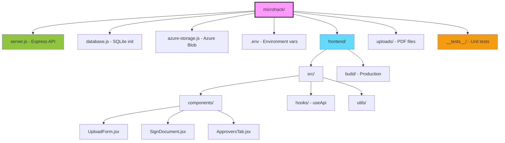

# AI Agent Guidelines

Tento súbor obsahuje pokyny pre AI agentov (GitHub Copilot, ChatGPT, Claude, atď.) pri práci s týmto projektom.

## 🎯 Projektový Kontext

### Základné informácie
- **Názov**: Microhack - Document Management & Approval System
- **Technológie**: Node.js (Express) + React + SQLite/Azure Blob Storage
- **Účel**: Nahrávanie, podpisovanie a schvaľovanie PDF dokumentov
- **Jazyk**: Slovenčina + Angličtina (i18n)

### Štruktúra projektu



## 📋 Kódovacie Štandardy

### Všeobecné pravidlá

#### ✅ ALWAYS DO:
- **Slovenské komentáre** v kóde (kód samotný v angličtine)
- **Konzistentné pomenovanie**: camelCase pre premenné, PascalCase pre komponenty
- **Error handling**: Vždy ošetri try-catch bloky a pošli validné error responses
- **Logging**: Console.log pre development, ale odstráň pre production
- **Environment variables**: Používaj `.env` súbory, nikdy nehardcoduj credentials

#### ❌ NEVER DO:
- Nemazaj existujúci funkčný kód bez povolenia
- Nemiešaj async/await s .then() callbacks
- Nevytváraj side effects v React useEffect bez cleanup
- Necommituj `.env` súbory s credentials
- Nepridávaj dependencies bez konzultácie

### Konvencie pomenovania

```javascript
// Premenné a funkcie - camelCase
const documentId = 123;
function getNextCaseId() { }

// Konstanty - UPPER_SNAKE_CASE
const UPLOAD_DIR = './uploads';
const MAX_FILE_SIZE = 10485760;

// React komponenty - PascalCase
function UploadForm() { }
const SignDocument = () => { };

// Private/helper funkcie - _prefix
function _validateEmail(email) { }

// Async funkcie - explicitný názov
async function saveFile() { }
async function fetchDocuments() { }
```

### File naming
```
components/MyComponent.jsx    # React komponenty - PascalCase
utils/documentUtils.js        # Utility súbory - camelCase
hooks/useApi.js              # Custom hooks - use prefix
__tests__/api.test.js        # Testy - .test.js suffix
```

## 🏗️ Architektúra

### Backend (server.js)

#### API Endpoints Pattern
```javascript
// Vždy použiť tento pattern:
app.post('/api/resource', async (req, res) => {
    try {
        // 1. Validácia inputu
        const { param1, param2 } = req.body;
        if (!param1) {
            return res.status(400).json({ error: 'Missing parameter' });
        }

        // 2. Business logika
        const result = await doSomething(param1, param2);

        // 3. Úspešná odpoveď
        res.json({ success: true, data: result });
    } catch (error) {
        // 4. Error handling
        console.error('Error:', error);
        res.status(500).json({ error: error.message });
    }
});
```

#### Database Pattern
```javascript
// Vždy používaj Promises alebo async/await
function getDocument(id) {
    return new Promise((resolve, reject) => {
        db.get('SELECT * FROM documents WHERE id = ?', [id], (err, row) => {
            if (err) reject(err);
            else resolve(row);
        });
    });
}

// Alebo pomocou util.promisify
const { promisify } = require('util');
const dbGet = promisify(db.get.bind(db));
```

#### Storage Abstraction
```javascript
// Vždy používaj abstraction layer - NEpristupuj priamo k fs alebo Azure
// ✅ SPRÁVNE:
await saveFile(fileName, buffer);
await getFile(fileName);
await deleteFile(fileName);

// ❌ ZLE:
fs.writeFileSync(path.join(UPLOAD_DIR, fileName), buffer);
```

### Frontend (React)

#### Component Pattern
```javascript
// Functional components s hooks
import React, { useState, useEffect } from 'react';
import useApi from '../hooks/useApi';

function MyComponent({ propA, propB }) {
    // 1. Hooks na vrchu
    const [state, setState] = useState(initialValue);
    const { get, post, loading, error } = useApi();

    // 2. useEffect pre side effects
    useEffect(() => {
        fetchData();
        
        // Cleanup function
        return () => {
            // cleanup
        };
    }, [dependencies]); // Dependency array!

    // 3. Event handlers
    const handleClick = async () => {
        try {
            const result = await post('/api/endpoint', data);
            setState(result);
        } catch (err) {
            console.error(err);
        }
    };

    // 4. Render
    return (
        <div>
            {loading && <p>Loading...</p>}
            {error && <p>Error: {error}</p>}
            {/* content */}
        </div>
    );
}

export default MyComponent;
```

#### API Calls Pattern
```javascript
// ✅ VŽDY používaj useApi hook
const { get, post, put, delete: del, loading, error } = useApi();

// ❌ NIKDY nepridávaj axios priamo v komponentoch
import axios from 'axios'; // ZLE!
```

#### State Management
```javascript
// Jednoduchý state - useState
const [value, setValue] = useState('');

// Komplexný state - useState s objektom
const [formData, setFormData] = useState({
    name: '',
    email: '',
    status: 'Draft'
});

// Update: spread operator
setFormData(prev => ({ ...prev, name: 'New Name' }));

// Pre veľmi komplexný state - useReducer
const [state, dispatch] = useReducer(reducer, initialState);
```

## 🔧 Časté úlohy

### Pridanie nového API endpointu

1. **Backend (server.js)**:
```javascript
// 1. Pridaj endpoint
app.post('/api/new-endpoint', async (req, res) => {
    try {
        const { param } = req.body;
        // logic
        res.json({ success: true });
    } catch (error) {
        res.status(500).json({ error: error.message });
    }
});
```

2. **Frontend (component)**:
```javascript
// 2. Použiť v komponente
const { post } = useApi();
const result = await post('/new-endpoint', { param: value });
```

### Pridanie novej database tabuľky

1. **Upraviť database.js**:
```javascript
db.run(`
    CREATE TABLE IF NOT EXISTS table_name (
        id INTEGER PRIMARY KEY AUTOINCREMENT,
        field1 TEXT NOT NULL,
        field2 INTEGER DEFAULT 0,
        created_at DATETIME DEFAULT CURRENT_TIMESTAMP
    )
`);
```

2. **Pridať foreign keys ak treba**:
```javascript
FOREIGN KEY (other_id) REFERENCES other_table(id) ON DELETE CASCADE
```

3. **Enable foreign keys**:
```javascript
db.run('PRAGMA foreign_keys = ON');
```

### Pridanie nového React komponentu

1. **Vytvoriť súbor**: `frontend/src/components/MyComponent.jsx`
2. **Použiť template** (viď Component Pattern vyššie)
3. **Pridať do parent komponentu**:
```javascript
import MyComponent from './components/MyComponent';
```

### Pridanie novej funkcionality

1. ✅ **VŽDY najprv napíš test** (`__tests__/feature.test.js`)
2. ✅ Implementuj funkcionalitu
3. ✅ Spusti testy: `npm test`
4. ✅ Updatuj dokumentáciu

## 🧪 Testing

### Test Pattern
```javascript
describe('Feature Name', () => {
    beforeEach(() => {
        // Setup
    });

    afterEach(() => {
        // Cleanup
        jest.clearAllMocks();
    });

    test('should do something specific', async () => {
        // Arrange
        const input = 'test';
        
        // Act
        const result = await functionUnderTest(input);
        
        // Assert
        expect(result).toBe(expected);
    });
});
```

### Running Tests
```bash
npm test                    # Všetky testy
npm run test:watch          # Watch mode
npm run test:db             # Len database
npm run test:api            # Len API
npm test -- --coverage      # Coverage report
```

## 🚀 Deployment

### Local Development
```bash
# Backend
npm install
npm start                   # Port 3001

# Frontend
cd frontend
npm install
npm start                   # Port 3000
```

### Azure Deployment
```bash
# Priprav environment
cp .env.example .env.azure
# Uprav .env.azure s Azure credentials

# Deploy
npm run deploy:azure
```

## 📦 Dependencies Management

### Pridanie novej závislosti

#### Backend:
```bash
cd project-root
npm install package-name
npm install --save-dev package-name  # Pre dev dependencies
```

#### Frontend:
```bash
cd frontend
npm install package-name
```

### Core Dependencies (NEMEŇ BEZ DÔVODU)
- **express**: 5.1.0 - Web framework
- **sqlite3**: 5.1.7 - Database
- **multer**: 2.0.2 - File uploads
- **pdf-lib**: 1.17.1 - PDF manipulation
- **react**: 19.2.0 - UI framework
- **@azure/storage-blob**: 12.17.0 - Azure storage

## 🔐 Security Guidelines

### Environment Variables
```javascript
// ✅ SPRÁVNE:
const apiKey = process.env.API_KEY;
const storageAccount = process.env.AZURE_STORAGE_ACCOUNT;

// ❌ ZLE:
const apiKey = 'hardcoded-secret-key';
```

### SQL Injection Prevention
```javascript
// ✅ SPRÁVNE - parameterized queries:
db.get('SELECT * FROM users WHERE id = ?', [userId], callback);

// ❌ ZLE - string concatenation:
db.get(`SELECT * FROM users WHERE id = ${userId}`, callback);
```

### File Upload Validation
```javascript
// Vždy validuj:
// 1. File type (len PDF)
// 2. File size (max 10MB)
// 3. Filename (sanitize)

const allowedTypes = ['application/pdf'];
const maxSize = 10 * 1024 * 1024; // 10MB

if (!allowedTypes.includes(file.mimetype)) {
    return res.status(400).json({ error: 'Only PDF files allowed' });
}
```

## 🐛 Debugging

### Backend Debugging
```javascript
// 1. Console logging
console.log('Debug:', variable);
console.error('Error:', error);

// 2. Inspect database
db.all('SELECT * FROM table', [], (err, rows) => {
    console.table(rows);
});

// 3. Check environment
console.log('ENV:', process.env.NODE_ENV);
console.log('Storage:', process.env.STORAGE_TYPE);
```

### Frontend Debugging
```javascript
// 1. React DevTools (browser extension)
// 2. Console logging
console.log('State:', state);
console.log('Props:', props);

// 3. Network tab (check API calls)
// 4. useEffect dependency warning - VŽDY oprav!
```

### Common Issues

#### Database locked
```javascript
// Riešenie: Zatvor všetky connections
db.close((err) => {
    if (err) console.error(err);
});
```

#### CORS errors
```javascript
// Skontroluj server.js:
app.use(cors({
    origin: process.env.CORS_ORIGIN || '*'
}));
```

#### File not found
```javascript
// Skontroluj STORAGE_TYPE v .env:
STORAGE_TYPE=local  # alebo 'azure'
```

## 📚 Dokumentácia

### Kde hľadať info:
- `README.md` - Základný prehľad projektu
- `DOKUMENTACIA.md` - User & technical dokumentácia (900+ riadkov)
- `DESIGN_DOCUMENT.md` - Architectural design
- `AZURE_DEPLOYMENT.md` - Azure deployment guide
- `TESTING.md` - Testing guidelines
- **Tento súbor** - Agent guidelines

### Aktualizácia dokumentácie
Pri zmene funkcionality **VŽDY** aktualizuj:
1. Kód komentáre
2. Relevantný MD súbor
3. API dokumentáciu (ak sa menili endpointy)
4. CHANGELOG (pre väčšie zmeny)

## 🎨 UI/UX Guidelines

### Styling
- Používaj CSS triedy z `UploadSignApp.css`
- Dodržuj color scheme:
  - Primary: `#0078d4` (modrá)
  - Success: `#107c10` (zelená)
  - Warning: `#f7b500` (oranžová)
  - Error: `#d13438` (červená)
  - Draft: `#8a8886` (sivá)

### Responsive Design
```css
/* Desktop first approach */
.container {
    width: 100%;
    max-width: 1200px;
}

/* Mobile */
@media (max-width: 768px) {
    .container {
        padding: 10px;
    }
}
```

### Internationalization
```javascript
// Používaj i18n pre všetky texty
import { useTranslation } from 'react-i18next';

function MyComponent() {
    const { t } = useTranslation();
    return <h1>{t('myKey')}</h1>;
}

// Pridaj do i18n.js:
resources: {
    sk: { translation: { myKey: 'Môj text' } },
    en: { translation: { myKey: 'My text' } }
}
```

## 📊 Performance

### Backend
```javascript
// ✅ Používaj connection pooling pre DB
// ✅ Cachuj časté queries
// ✅ Používaj indexy v databáze
// ✅ Komprimuj responses (gzip)

// Príklad: compression middleware
const compression = require('compression');
app.use(compression());
```

### Frontend
```javascript
// ✅ Lazy loading komponentov
const MyComponent = React.lazy(() => import('./MyComponent'));

// ✅ Memo pre expensive computations
const memoizedValue = useMemo(() => computeExpensiveValue(a, b), [a, b]);

// ✅ Callback memo pre event handlers
const handleClick = useCallback(() => {
    doSomething(param);
}, [param]);

// ❌ Vyhýbaj sa inline functions v renderoch (pre veľké listy)
```

## 🔄 Git Workflow

### Commit Messages
```
feat: Pridaný nový endpoint pre schvaľovateľov
fix: Opravený bug pri nahrávaní súborov
docs: Aktualizovaná dokumentácia API
test: Pridané testy pre Azure Storage
refactor: Zjednodušený file upload logic
style: Formátovanie kódu
chore: Aktualizované dependencies
```

### Branch Naming
```
feature/nova-funkcionalita
bugfix/oprava-nahravania
hotfix/kriticky-bug
docs/aktualizacia-dokumentacie
```

## 🚨 Emergency Procedures

### Application Crashed
```bash
# 1. Check logs
npm start 2>&1 | tee error.log

# 2. Kill stuck processes
# Windows:
taskkill /F /IM node.exe

# 3. Clear node_modules
rm -rf node_modules
npm install

# 4. Reset database (POZOR - stratíš dáta!)
rm db.sqlite
npm start  # Recreates DB
```

### Database Corrupted
```bash
# 1. Backup
cp db.sqlite db.sqlite.backup

# 2. Check integrity
sqlite3 db.sqlite "PRAGMA integrity_check;"

# 3. Export/Import
sqlite3 db.sqlite ".dump" > dump.sql
rm db.sqlite
sqlite3 db.sqlite < dump.sql
```

### Azure Deployment Failed
```powershell
# 1. Check logs
az webapp log tail --name <app-name> --resource-group <rg-name>

# 2. Restart app
az webapp restart --name <app-name> --resource-group <rg-name>

# 3. Re-deploy
npm run deploy:azure
```

## 💡 Best Practices Summary

### Code Quality Checklist
- [ ] Kód má jasné komentáre (slovensky)
- [ ] Error handling je implementovaný
- [ ] Testy sú napísané a prechádzajú
- [ ] Žiadne console.log v production kóde
- [ ] Environment variables namiesto hardcoded values
- [ ] SQL queries používajú parametre (nie string concat)
- [ ] React useEffect má dependency array
- [ ] Žiadne unused imports/variables
- [ ] Dokumentácia je aktualizovaná

### Performance Checklist
- [ ] Database queries sú optimalizované
- [ ] Veľké súbory sa streamujú (nie buffer do pamäte)
- [ ] React komponenty používajú memo kde treba
- [ ] API responses sú paginated (pre veľké datasety)
- [ ] Images/assets sú komprimované

### Security Checklist
- [ ] Input validácia na server-side
- [ ] Parameterized SQL queries
- [ ] File upload restrictions (type, size)
- [ ] CORS je správne nakonfigurovaný
- [ ] Credentials sú v .env (nie v kóde)
- [ ] HTTPS v produkcii

---

## 📞 Contact & Support

Pri problémoch konzultuj:
1. Tento súbor (agents.md)
2. Dokumentáciu (DOKUMENTACIA.md)
3. Existujúce testy ako príklady
4. Git history pre kontext zmien

**Happy coding!** 🚀
